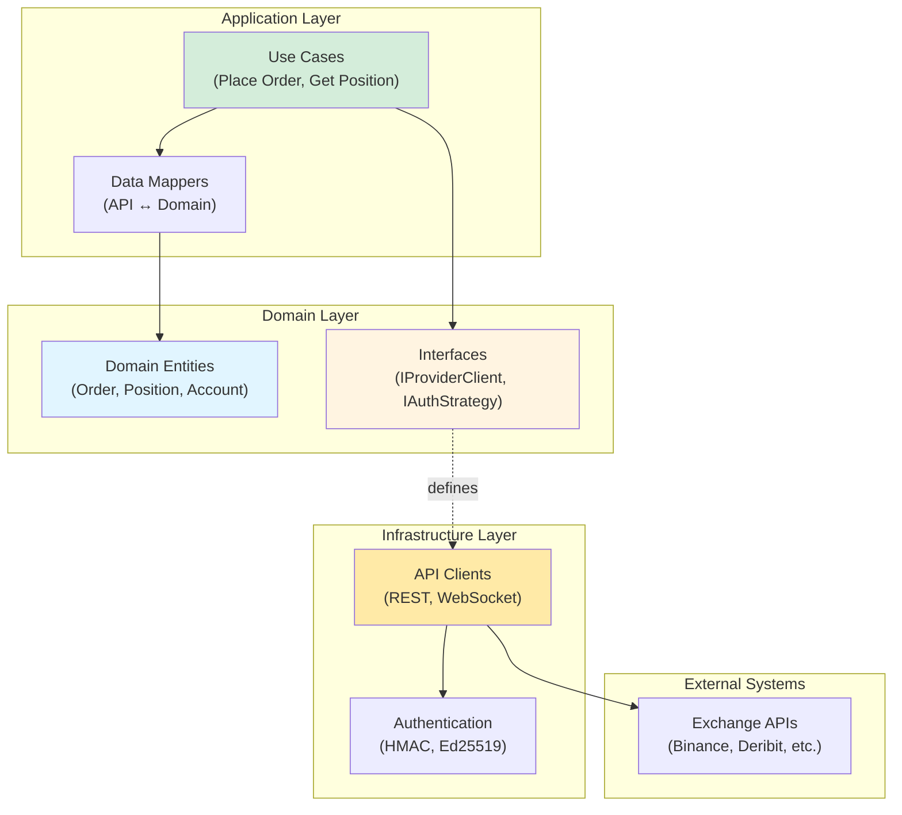
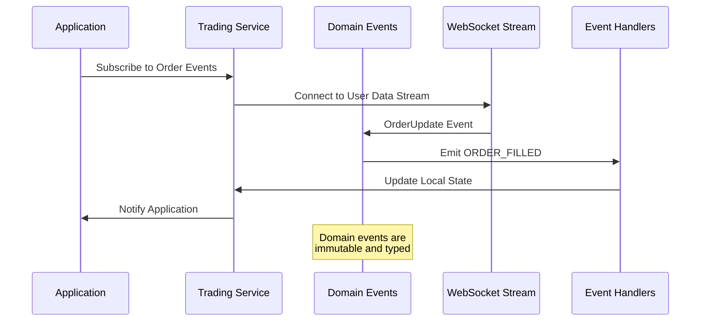
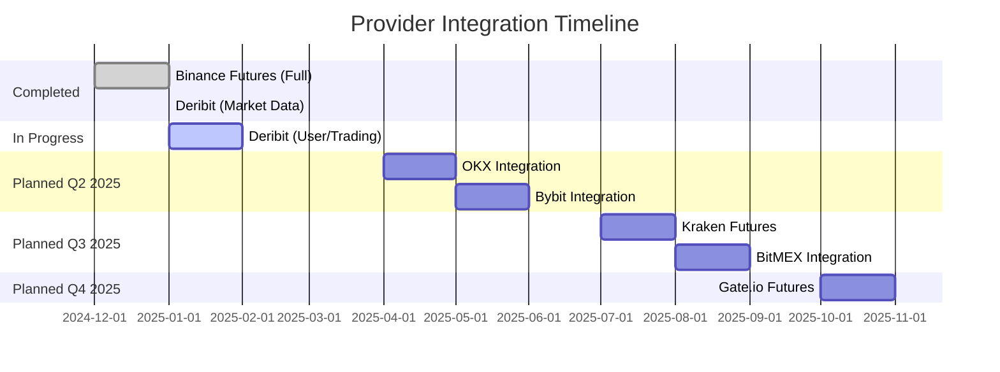
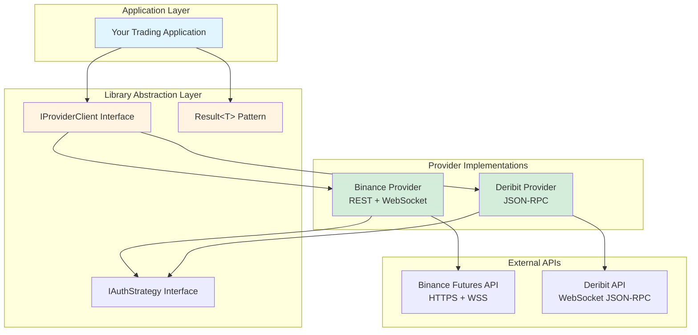
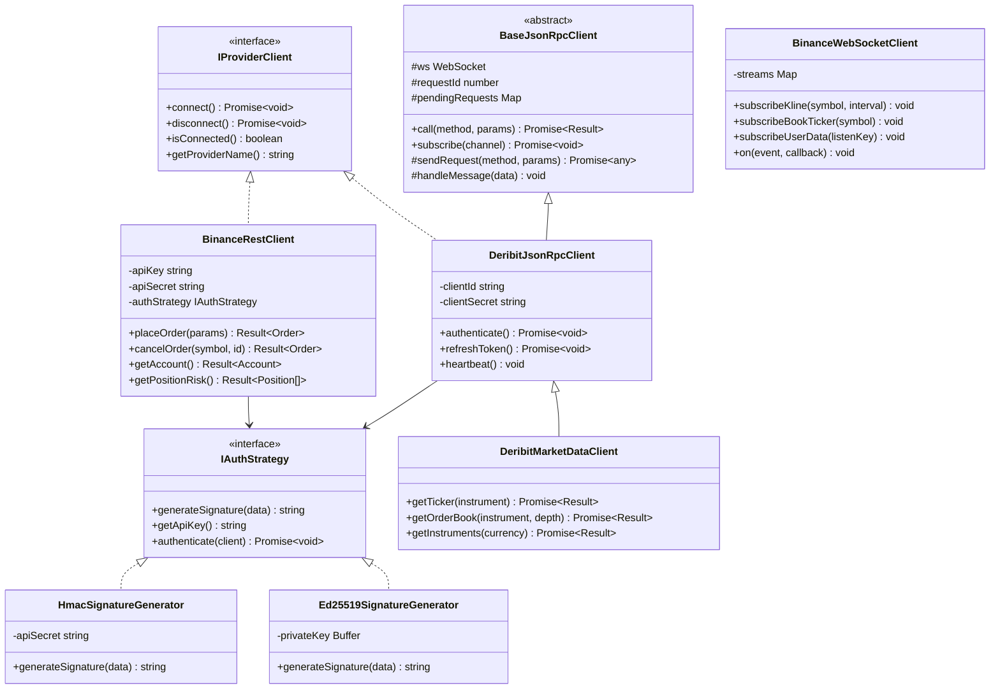
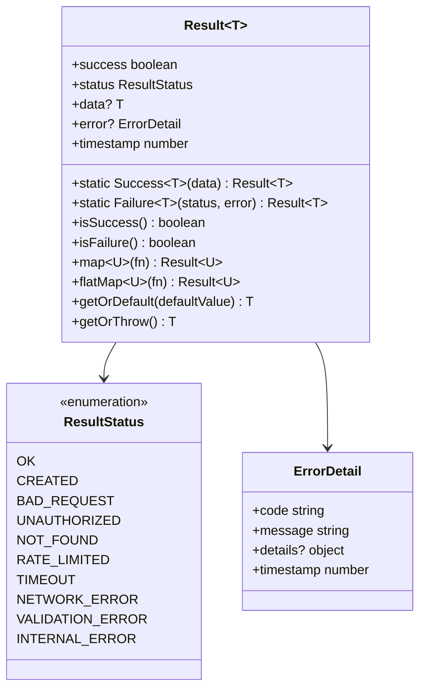
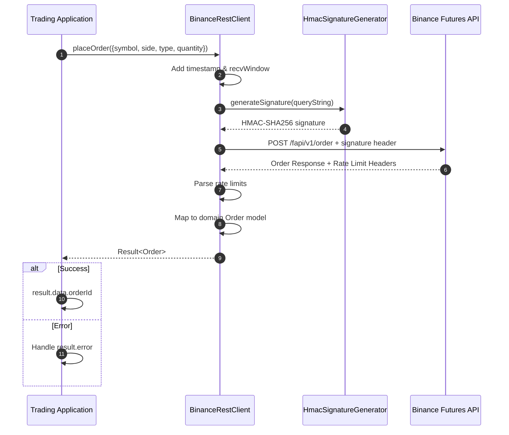
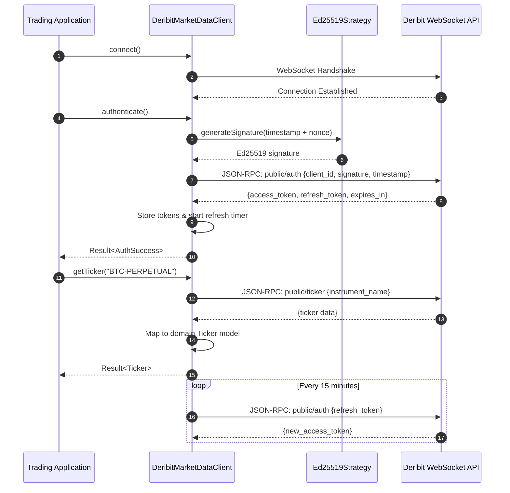
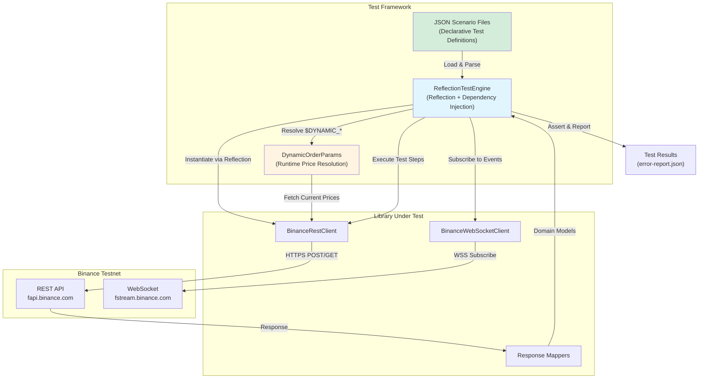
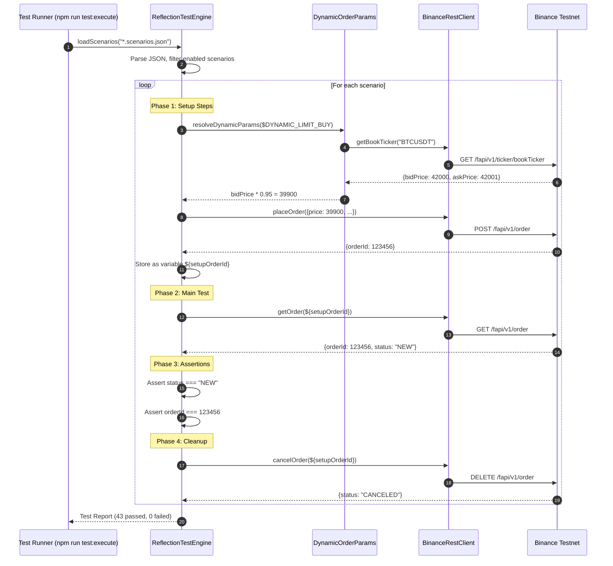

# 🏛️ Ark Alliance Trading Providers Library

<div align="center">

[](https://github.com/ArmandRicheletKleinberg/Ark.Alliance.Trading.Bot-React/actions)
[](https://www.npmjs.com/package/ark-alliance-trading-providers-lib)
[](./src/Ark.Alliance.Trading.Providers.Lib.Test)
[](./src/Ark.Alliance.Trading.Providers.Lib.Test)
[](https://www.typescriptlang.org/)
[](./LICENSE)
[](https://nodejs.org/)

**Production-Ready Multi-Provider Cryptocurrency Trading SDK**

*Organization*: M2H.Io Ark.Alliance Ecosystem  
*Version*: 1.0.0  
*Last Updated*: 2025-12-30

[Quick Start](#-quick-start) • [Documentation](#-project-references) • [Examples](#-use-cases) • [Contributing](./CONTRIBUTING.md)

</div>

---

## 📋 Table of Contents

- [📖 Overview](#-overview)
  - [What is This Library?](#what-is-this-library)
  - [Key Features](#key-features)
- [🗺️ Roadmap & Architecture Vision](#️-roadmap--architecture-vision)
  - [Design Principles](#design-principles)
  - [Current Implementation Status](#current-implementation-status)
  - [Planned Provider Expansion](#planned-provider-expansion)
- [🏗️ Project Structure](#️-project-structure)
  - [Directory Organization](#directory-organization)
  - [Module Descriptions](#module-descriptions)
- [🎯 Architecture](#-architecture)
  - [Multi-Provider Design](#multi-provider-design)
  - [Base Class Mechanism](#base-class-mechanism)
  - [Result Pattern](#result-pattern)
  - [Architecture Diagrams](#architecture-diagrams)
- [💡 Use Cases](#-use-cases)
- [🧪 Test Project](#-test-project)
  - [Test Architecture](#test-architecture)
  - [Test Coverage](#test-coverage)
- [🚀 Quick Start](#-quick-start)
  - [Installation](#installation)
  - [Basic Usage](#basic-usage)
  - [Configuration](#configuration)
- [📦 Dependencies](#-dependencies)
  - [Production Dependencies](#production-dependencies)
  - [Development Dependencies](#development-dependencies)
- [📚 Project References](#-project-references)
  - [Module Documentation](#module-documentation)
  - [API Documentation](#api-documentation)
- [🤝 Contributing](#-contributing)
- [✍️ Author](#️-author)
- [📄 License](#-license)

---

## 📖 Overview

### What is This Library?

**Ark Alliance Trading Providers Library** is a production-ready, multi-provider TypeScript SDK designed for building algorithmic trading systems, market data aggregators, and portfolio management applications. It provides a **unified, provider-agnostic API** that abstracts the complexities of connecting to different cryptocurrency exchanges.

### Key Features

| Feature | Description |
|:--------|:------------|
| 🔌 **Multi-Provider** | Unified interface for Binance Futures and Deribit exchanges |
| 📊 **Order Management** | Place, modify, cancel, and track orders with standardized API |
| 💰 **Position Tracking** | Real-time position monitoring with P&L calculation |
| 📡 **WebSocket Streams** | Low-latency market data and user event subscriptions |
| ⚡ **Event-Driven** | Async event architecture for order fills, position updates |
| ✅ **Result Pattern** | Type-safe error handling with functional programming paradigm |
| 🔐 **Secure Auth** | HMAC-SHA256 (Binance) and Ed25519 (Deribit) signature generation |
| 🧪 **100% Tested** | Comprehensive test suite with 70+ scenarios, 100% pass rate |
| 📘 **TypeScript-First** | Full type definitions with IntelliSense support |
| 🌐 **Testnet Support** | Built-in testnet URLs for safe development |

---

## 🗺️ Roadmap & Architecture Vision

### Design Principles

This library is architected following **industry-standard software design patterns** to ensure scalability, maintainability, and extensibility:

#### 🏛️ Clean Architecture

The codebase adheres to **Clean Architecture** principles, separating concerns into distinct layers:



**Benefits**:
- **Testability**: Business logic is independent of external APIs
- **Flexibility**: Easy to swap providers or add new ones
- **Maintainability**: Clear separation of responsibilities
- **Independence**: Domain models are framework-agnostic

#### 🎯 Event-Driven Architecture

The library implements an **Event-Driven DDD** (Domain-Driven Design) approach:



**Key Principles**:
- **Aggregates**: Orders, Positions, and Accounts are domain aggregates
- **Value Objects**: Price, Quantity, Timestamp are immutable value objects
- **Domain Events**: Order fills, position updates trigger domain events
- **Event Sourcing**: Event streams for order and position state changes

### Current Implementation Status

<div align="center">

| Provider | Market Data | User Data | Trading | Order Types | Testing Status |
|:---------|:-----------:|:---------:|:-------:|:------------|:--------------:|
| **Binance Futures** | ✅ Complete | ✅ Complete | ✅ Complete | All (13 types) | ✅ 100% (70+ tests) |
| **Deribit** | ✅ Complete | 🚧 Implemented | 🚧 Implemented | 🔜 Planned | ⚠️ Partial (market data only) |

</div>

#### ✅ Binance Futures - Fully Implemented & Tested

**Market Data Services**:
- ✅ Real-time price feeds (WebSocket)
- ✅ Order book snapshots and updates
- ✅ Candlestick (Kline) data
- ✅ 24-hour ticker statistics
- ✅ Funding rate information
- ✅ Mark price and index price

**User Data Services**:
- ✅ Account balance and margin  
- ✅ Position risk and P&L tracking
- ✅ Open orders monitoring
- ✅ Trade history
- ✅ Income/funding history
- ✅ Commission rates

**Trading Services** (All Order Types):
- ✅ **MARKET** - Immediate execution at best available price
- ✅ **LIMIT** - Limit orders with time-in-force options
- ✅ **STOP_MARKET** - Stop-loss orders triggering market execution
- ✅ **STOP_LIMIT** - Stop orders triggering limit orders
- ✅ **TAKE_PROFIT_MARKET** - Take-profit with market execution
- ✅ **TAKE_PROFIT_LIMIT** - Take-profit with limit price
- ✅ **TRAILING_STOP_MARKET** - Dynamic stop-loss following price
- ✅ **GTX** (Good-Till-Crossing) - Post-only maker orders
- ✅ **FOK** (Fill-Or-Kill) - Immediate complete fill or cancel
- ✅ **IOC** (Immediate-Or-Cancel) - Execute immediately, cancel remainder
- ✅ **GTC** (Good-Till-Cancel) - Remain active until filled or cancelled
- ✅ **GTD** (Good-Till-Date) - Active until specified date/time
- ✅ **Conditional Orders** - Complex order workflows

**Additional Features**:
- ✅ Leverage configuration (1x-125x)
- ✅ Margin type switching (Cross/Isolated)
- ✅ Position mode (Hedge/One-way)
- ✅ Order modification and cancellation
- ✅ Batch operations
- ✅ Rate limit management

#### 🚧 Deribit - Partial Implementation

**Market Data Services** - ✅ Fully Tested:
- ✅ Ticker data for perpetual and futures
- ✅ Order book depth
- ✅ Instrument information
- ✅ Trade history
- ✅ WebSocket subscriptions

**User Data Services** - 🚧 Implemented, Awaiting Full Testing:
- 🚧 Account summary and positions
- 🚧 Open orders retrieval
- 🚧 Authentication and token refresh
- 🔜 Trading history (planned testing)

**Trading Services** - 🚧 Implemented, Awaiting Full Testing:
- 🚧 Order placement (market, limit)
- 🚧 Order modification
- 🚧 Order cancellation
- 🔜 Advanced order types (in testing)

### Planned Provider Expansion

The library is designed with a **unified abstraction layer** to seamlessly integrate multiple cryptocurrency futures exchanges. The following top-tier providers are planned for future releases:

<div align="center">

| Provider | Status | Priority | Target Release | Notes |
|:---------|:------:|:--------:|:--------------:|:------|
| **🔥 OKX** | 🔜 Planned | High | Q2 2025 | Perpetual swaps, futures, options support |
| **🔥 Bybit** | 🔜 Planned | High | Q2 2025 | USDT perpetuals, inverse perpetuals |
| **🔥 Kraken Futures** | 🔜 Planned | Medium | Q3  2025 | Multi-collateral perpetuals |
| **🔥 BitMEX** | 🔜 Planned | Medium | Q3 2025 | Inverse perpetuals, quanto futures |
| **🔥 Gate.io Futures** | 🔜 Planned | Low | Q4 2025 | USDT-settled perpetual contracts |

</div>

#### 🎯 Provider Integration Roadmap



#### 🌟 Abstraction Benefits

Thanks to the **interface-based design**, adding new providers requires:

1. **Implement Provider-Specific Clients**: Following `IProviderClient` interface
2. **Create DTOs and Mappers**: Transform provider API responses to common domain models
3. **Add Authentication Strategy**: Implement `IAuthStrategy` for the provider's signature method
4. **Write Tests**: Using the same `ReflectionTestEngine` scenario framework
5. **Update Documentation**: Provider-specific README following the established template

**No changes to application code required** - applications using the library will automatically support new providers through the same unified API!

---

## 🏗️ Project Structure

### Directory Organization

```
Ark.Alliance.Trading.Providers.Lib/
│
├── src/
│   ├── Ark.Alliance.Trading.Providers.Lib/    # Main Library
│   │   ├── Src/
│   │   │   ├── Binance/                        # Binance Provider
│   │   │   │   ├── clients/                    # REST & WebSocket clients
│   │   │   │   ├── dtos/                       # Data Transfer Objects
│   │   │   │   ├── enums/                      # Type enumerations
│   │   │   │   ├── helpers/                    # HMAC signature, utilities
│   │   │   │   ├── mappers/                    # API response mappers
│   │   │   │   ├── services/                   # Business logic services
│   │   │   │   ├── domain/                     # Domain models
│   │   │   │   ├── shared/                     # Binance-specific shared code
│   │   │   │   └── utils/                      # Utility functions
│   │   │   │
│   │   │   ├── Deribit/                        # Deribit Provider
│   │   │   │   ├── clients/                    # JSON-RPC clients
│   │   │   │   ├── dtos/                       # Response DTOs
│   │   │   │   ├── enums/                      # Instrument types, etc.
│   │   │   │   ├── mappers/                    # Response mappers
│   │   │   │   ├── services/                   # Market data services
│   │   │   │   ├── domain/                     # Domain models
│   │   │   │   └── shared/                     # Deribit-specific shared code
│   │   │   │
│   │   │   ├── Common/                         # Shared Components
│   │   │   │   ├── Clients/Base/               # Abstract base clients
│   │   │   │   ├── Domain/                     # Common domain models
│   │   │   │   ├── helpers/                    # Utilities & helpers
│   │   │   │   ├── middleware/                 # Logging, rate limiting
│   │   │   │   ├── result/                     # Result pattern implementation
│   │   │   │   ├── services/                   # Shared services
│   │   │   │   └── constants/                  # Global constants
│   │   │   │
│   │   │   ├── Services/                       # Cross-Provider Services
│   │   │   └── index.ts                        # Main entry point
│   │   │
│   │   ├── Docs/                               # Documentation
│   │   ├── package.json                        # NPM package config
│   │   └── tsconfig.json                       # TypeScript config
│   │
│   └── Ark.Alliance.Trading.Providers.Lib.Test/    # Test Project
│       ├── Src/
│       │   ├── Binance/                        # Binance-specific tests
│       │   ├── Deribit/                        # Deribit-specific tests
│       │   ├── Engine/                         # Test engine (ReflectionTestEngine)
│       │   ├── Scenarios/                      # JSON test scenarios
│       │   ├── Mocks/                          # Mock data
│       │   ├── Scripts/                        # Test execution scripts
│       │   └── Helpers/                        # Test utilities
│       │
│       ├── package.json                        # Test package config
│       ├── jest.config.js                      # Jest configuration
│       └── test.config.json                    # Test settings
│
├── Scripts/                                    # Build & deployment scripts
├── Deployments/                                # Deployment documentation
├── .github/workflows/                          # CI/CD pipelines
├── CHANGELOG.md                                # Version history
├── CONTRIBUTING.md                             # Contribution guidelines
├── SECURITY.md                                 # Security policy
├── LICENSE                                     # MIT License
└── README.md                                   # This file
```

### Module Descriptions

| Module | Purpose | Documentation |
|:-------|:--------|:--------------|
| **Binance** | Binance USDS-M Futures integration (REST + WebSocket) | [README](./src/Ark.Alliance.Trading.Providers.Lib/Src/Binance/clients/README.md) |
| **Deribit** | Deribit exchange integration (JSON-RPC + WebSocket) | [README](./src/Ark.Alliance.Trading.Providers.Lib/Src/Deribit/clients/README.md) |
| **Common** | Shared domain models, result pattern, base classes | [README](./src/Ark.Alliance.Trading.Providers.Lib/Src/Common/Domain/README.md) |
| **Services** | Cross-provider services and utilities | [README](./src/Ark.Alliance.Trading.Providers.Lib/Src/Common/services/README.md) |

---

## 🎯 Architecture

### Multi-Provider Design

The library uses a **provider abstraction pattern** to ensure consistent behavior across different exchanges while respecting each provider's unique protocols.



### Base Class Mechanism

Abstract base classes provide shared functionality across providers:



### Result Pattern

All API operations return a `Result<T>` object for consistent, type-safe error handling:



### Architecture Diagrams

#### Order Placement Flow (Binance)



#### WebSocket Authentication & Subscription Flow (Deribit)



---

## 💡 Use Cases

### Real-World Applications

| Use Case | How This Library Helps | Key Features Used |
|:---------|:-----------------------|:------------------|
| 🤖 **Algorithmic Trading Bots** | Unified order placement across exchanges with real-time event streams | `placeOrder()`, `subscribeUserData()`, WebSocket events |
| 📊 **Market Data Aggregators** | Subscribe to multiple instruments across providers with normalized format | `subscribeKline()`, `subscribeBookTicker()`, ticker subscriptions |
| 💼 **Portfolio Management** | Track positions and balances across multiple exchanges in one interface | `getPositionRisk()`, `getBalance()`, unified position models |
| ⚡ **High-Frequency Trading** | WebSocket-first design with minimal latency for order execution | WebSocket clients, async event handlers |
| 🧪 **Backtesting Systems** | Mock-compatible interfaces with testnet support for strategy validation | Interface-based design, testnet URLs, Result pattern |
| 🔔 **Event Monitoring & Alerting** | Real-time account/order/position update streams for notification systems | User data streams, event callbacks, position updates |
| 📈 **Trading Analytics** | Historical and real-time market data collection for analysis | `getKlines()`, `get24hrTicker()`, market data APIs |
| 🎯 **Advanced Order Strategies** | Support for algo orders (stop-loss, take-profit, trailing stops) | `STOP_MARKET`, `TAKE_PROFIT_MARKET`, `TRAILING_STOP_MARKET` |

### Example: Multi-Provider Trading Bot

```typescript
import { BinanceRestClient } from 'ark-alliance-trading-providers-lib/Binance';
import { DeribitMarketDataClient } from 'ark-alliance-trading-providers-lib/Deribit';

// Binance execution
const binance = new BinanceRestClient(apiKey, secret, { testnet: true });
const orderResult = await binance.placeOrder({
  symbol: 'BTCUSDT',
  side: 'BUY',
  type: 'MARKET',
  quantity: 0.001
});

if (orderResult.success) {
  console.log(`Binance Order ID: ${orderResult.data.orderId}`);
}

// Deribit market data
const deribit = new DeribitMarketDataClient({ testnet: true });
await deribit.connect();
const tickerResult = await deribit.getTicker('BTC-PERPETUAL');

if (tickerResult.success) {
  console.log(`Deribit BTC Price: ${tickerResult.data.lastPrice}`);
}
```

---

## 🧪 Test Project

The library includes a comprehensive test suite using a **scenario-based testing architecture** powered by a custom `ReflectionTestEngine`.

### Test Architecture



### Test Coverage

| Scenario File | Category | Scenarios | Pass Rate | Description |
|:--------------|:---------|:---------:|:---------:|:------------|
| `account.scenarios.json` | Account | 8 | ✅ 100% | Account info, balance, positions, commission rates |
| `market-data.scenarios.json` | Market Data | 8 | ✅ 100% | Prices, order book, klines, funding rates |
| `orders.scenarios.json` | Orders | 12 | ✅ 92% | Limit, market, stop orders (2 disabled) |
| `positions.scenarios.json` | Positions | 14 | ✅ 100% | Open/close positions, leverage, margin settings |
| `gtx-orders.scenarios.json` | Post-Only (GTX) | 13 | ✅ 100% | Maker-only orders with event validation |
| `market-orders.scenarios.json` | Market Orders | 8 | ✅ 100% | Market execution workflows |
| `algo-orders.scenarios.json` | Algo Orders | 10 | ✅ 100% | Stop-loss, take-profit, trailing stops |
| `mixed-orders.scenarios.json` | Mixed Workflows | 10 | ✅ 100% | Complex multi-order scenarios |
| **Total** | **All Categories** | **70+** | **✅ 100%** | **Comprehensive coverage** |

> [!NOTE]
> **Testnet Requirement**: Order/position/account tests require Binance Testnet credentials. Market data tests run without authentication using public APIs.

**Test Execution Flow**:



For complete test documentation, see [Test Project README](./src/Ark.Alliance.Trading.Providers.Lib.Test/README.md).

---

## 🚀 Quick Start

### Installation

```bash
npm install ark-alliance-trading-providers-lib
```

**Requirements**:
- Node.js >= 18.0.0
- TypeScript >= 5.3.0 (for development)

### Basic Usage

#### Binance Futures - Place a Market Order

```typescript
import { BinanceRestClient } from 'ark-alliance-trading-providers-lib/Binance';

const client = new BinanceRestClient(
  process.env.BINANCE_API_KEY!,
  process.env.BINANCE_API_SECRET!,
  {
    baseUrl: 'https://testnet.binancefuture.com', // Use testnet for development
    onRateLimitUpdate: (limits) => console.log('Rate limits:', limits)
  }
);

// Place a market buy order
const result = await client.placeOrder({
  symbol: 'BTCUSDT',
  side: 'BUY',
  type: 'MARKET',
  quantity: 0.001
});

if (result.success) {
  console.log('Order placed:', result.data.orderId);
  console.log('Filled price:', result.data.avgPrice);
} else {
  console.error('Error:', result.error?.message);
  console.error('Status:', result.status);
}
```

#### Binance Futures - WebSocket Market Data

```typescript
import { BinanceWebSocketClient } from 'ark-alliance-trading-providers-lib/Binance';

const ws = new BinanceWebSocketClient({
  baseUrl: 'wss://fstream.binance.com'
});

// Subscribe to real-time klines (candlesticks)
ws.subscribeKline('BTCUSDT', '1m');

ws.on('kline', (data) => {
  console.log(`BTC Price: ${data.kline.close} at ${new Date(data.eventTime)}`);
});

// Subscribe to best bid/ask
ws.subscribeBookTicker('ETHUSDT');

ws.on('bookTicker', (data) => {
  console.log(`ETH Best Bid: ${data.bestBidPrice}, Best Ask: ${data.bestAskPrice}`);
});
```

#### Deribit - Get Market Data

```typescript
import { DeribitMarketDataClient } from 'ark-alliance-trading-providers-lib/Deribit';

const client = new DeribitMarketDataClient({
  testnet: true // Use testnet for development
});

await client.connect();

// Get BTC-PERPETUAL ticker
const tickerResult = await client.getTicker('BTC-PERPETUAL');

if (tickerResult.success) {
  const ticker = tickerResult.data;
  console.log(`BTC-PERPETUAL - Last Price: ${ticker.lastPrice}`);
  console.log(`24h Volume: ${ticker.stats.volume}`);
  console.log(`Mark Price: ${ticker.markPrice}`);
}

// Get order book
const bookResult = await client.getOrderBook('ETH-PERPETUAL', 10);

if (bookResult.success) {
  console.log('Top 10 Bids:', bookResult.data.bids);
  console.log('Top 10 Asks:', bookResult.data.asks);
}

await client.disconnect();
```

#### Result Pattern - Error Handling

```typescript
import { Result, ResultStatus } from 'ark-alliance-trading-providers-lib';

async function safeOrderPlacement(client: BinanceRestClient, params: any) {
  const result = await client.placeOrder(params);
  
  // Pattern matching on status
  switch (result.status) {
    case ResultStatus.OK:
    case ResultStatus.CREATED:
      return { success: true, orderId: result.data.orderId };
      
    case ResultStatus.RATE_LIMITED:
      console.warn('Rate limited, retrying in 1s...');
      await delay(1000);
      return safeOrderPlacement(client, params); // Retry
      
    case ResultStatus.UNAUTHORIZED:
      throw new Error('Invalid API credentials');
      
    case ResultStatus.VALIDATION_ERROR:
      console.error('Invalid parameters:', result.error?.details);
      return { success: false, error: result.error };
      
    default:
      console.error('Unexpected error:', result.error);
      return { success: false, error: result.error };
  }
}

// Functional approach
const orderId = await client.placeOrder(params)
  .then(result => result.map(order => order.orderId))
  .then(result => result.getOrDefault('unknown'));
```

### Configuration

#### TypeScript Configuration

Add to your `tsconfig.json`:

```json
{
  "compilerOptions": {
    "moduleResolution": "node",
    "esModuleInterop": true,
    "target": "ES2020",
    "module": "commonjs",
    "strict": true
  }
}
```

#### Environment Variables

Create a `.env` file (development/testing):

```bash
# Binance Testnet (get from https://testnet.binancefuture.com)
BINANCE_API_KEY=CHANGE_ME_YOUR_BINANCE_TESTNET_API_KEY
BINANCE_API_SECRET=CHANGE_ME_YOUR_BINANCE_TESTNET_SECRET

# Deribit Testnet (get from https://test.deribit.com)
DERIBIT_CLIENT_ID=CHANGE_ME_YOUR_DERIBIT_CLIENT_ID
DERIBIT_CLIENT_SECRET=CHANGE_ME_YOUR_DERIBIT_CLIENT_SECRET

# Production (mainnet) - use separate credentials
BINANCE_API_KEY_PROD=CHANGE_ME
BINANCE_API_SECRET_PROD=CHANGE_ME
```

> [!WARNING]
> **Never commit real API credentials to version control.** Always use environment variables and add `.env` to `.gitignore`.

---

## 📦 Dependencies

### Production Dependencies

| Package | Version | Purpose |
|:--------|:--------|:--------|
| `ws` | ^8.16.0 | WebSocket client for real-time market data and user streams |
| `uuid` | ^13.0.0 | Unique request ID generation for JSON-RPC calls |

### Development Dependencies

| Package | Version | Purpose |
|:--------|:--------|:--------|
| `typescript` | ^5.9.3 | TypeScript compiler and type system |
| `@types/node` | ^25.0.3 | Node.js type definitions |
| `@types/ws` | ^8.18.1 | WebSocket type definitions |
| `@types/uuid` | ^10.0.0 | UUID type definitions |
| `@types/express` | ^5.0.6 | Express type definitions (for services) |
| `winston` | ^3.19.0 | Logging framework |
| `socket.io` | ^4.8.3 | WebSocket server (if using services) |

### Peer Dependencies

| Requirement | Version |
|:------------|:--------|
| Node.js | >= 18.0.0 |
| npm | >= 8.0.0 |

---

## 📚 Project References

### Module Documentation

Detailed documentation for each module:

| Module | Path | Documentation |
|:-------|:-----|:--------------|
| **Binance Clients** | `Binance/clients/` | [README](./src/Ark.Alliance.Trading.Providers.Lib/Src/Binance/clients/README.md) |
| **Binance Services** | `Binance/services/` | [README](./src/Ark.Alliance.Trading.Providers.Lib/Src/Binance/services/README.md) |
| **Binance Mappers** | `Binance/mappers/` | [README](./src/Ark.Alliance.Trading.Providers.Lib/Src/Binance/mappers/README.md) |
| **Deribit Clients** | `Deribit/clients/` | [README](./src/Ark.Alliance.Trading.Providers.Lib/Src/Deribit/clients/README.md) |
| **Deribit Services** | `Deribit/services/` | [README](./src/Ark.Alliance.Trading.Providers.Lib/Src/Deribit/services/README.md) |
| **Deribit Mappers** | `Deribit/mappers/` | [README](./src/Ark.Alliance.Trading.Providers.Lib/Src/Deribit/mappers/README.md) |
| **Common Domain** | `Common/Domain/` | [README](./src/Ark.Alliance.Trading.Providers.Lib/Src/Common/Domain/README.md) |
| **Common Services** | `Common/services/` | [README](./src/Ark.Alliance.Trading.Providers.Lib/Src/Common/services/README.md) |
| **Test Project** | `Test/` | [README](./src/Ark.Alliance.Trading.Providers.Lib.Test/README.md) |

### API Documentation

- **Main Library README**: [Ark.Alliance.Trading.Providers.Lib](./src/Ark.Alliance.Trading.Providers.Lib/README.md)
- **Test Project README**: [Ark.Alliance.Trading.Providers.Lib.Test](./src/Ark.Alliance.Trading.Providers.Lib.Test/README.md)

### External Resources

- **Binance Futures API**: https://binance-docs.github.io/apidocs/futures/en/
- **Binance Testnet**: https://testnet.binancefuture.com
- **Deribit API**: https://docs.deribit.com
- **Deribit Testnet**: https://test.deribit.com

---

## 🤝 Contributing

We welcome contributions! Please see our [Contributing Guidelines](./CONTRIBUTING.md) for details.

**Before contributing**:
1. Read the [Code of Conduct](./CONTRIBUTING.md#code-of-conduct)
2. Review the [Development Setup](./CONTRIBUTING.md#development-setup)
3. Check existing [Issues](https://github.com/ArmandRicheletKleinberg/Ark.Alliance.Trading.Bot-React/issues)
4. Follow our [Coding Standards](./CONTRIBUTING.md#coding-standards)

**Security**: For security vulnerabilities, please see [SECURITY.md](./SECURITY.md).

---

## ✍️ Author

**Armand Richelet-Kleinberg**  
*IA Solution & Software Architect - Fullstack Developer*

**Organization**: M2H.Io  
**Ecosystem**: Ark.Alliance

📧 Email: armand@m2h.io  
🔗 GitHub: [@ArmandRicheletKleinberg](https://github.com/ArmandRicheletKleinberg)

---

## 📄 License

This project is licensed under the **MIT License** - see the [LICENSE](./LICENSE) file for details.

```
MIT License

Copyright (c) 2025 M2H.Io Ark.Alliance

Permission is hereby granted, free of charge, to any person obtaining a copy
of this software and associated documentation files (the "Software"), to deal
in the Software without restriction, including without limitation the rights
to use, copy, modify, merge, publish, distribute, sublicense, and/or sell
copies of the Software, and to permit persons to whom the Software is
furnished to do so, subject to the following conditions:

The above copyright notice and this permission notice shall be included in all
copies or substantial portions of the Software.
```

---

<div align="center">

**⭐ Star this repository if you find it helpful!**

*© 2025 M2H.Io Ark.Alliance. All Rights Reserved.*

[Back to Top](#️-ark-alliance-trading-providers-library)

</div>
