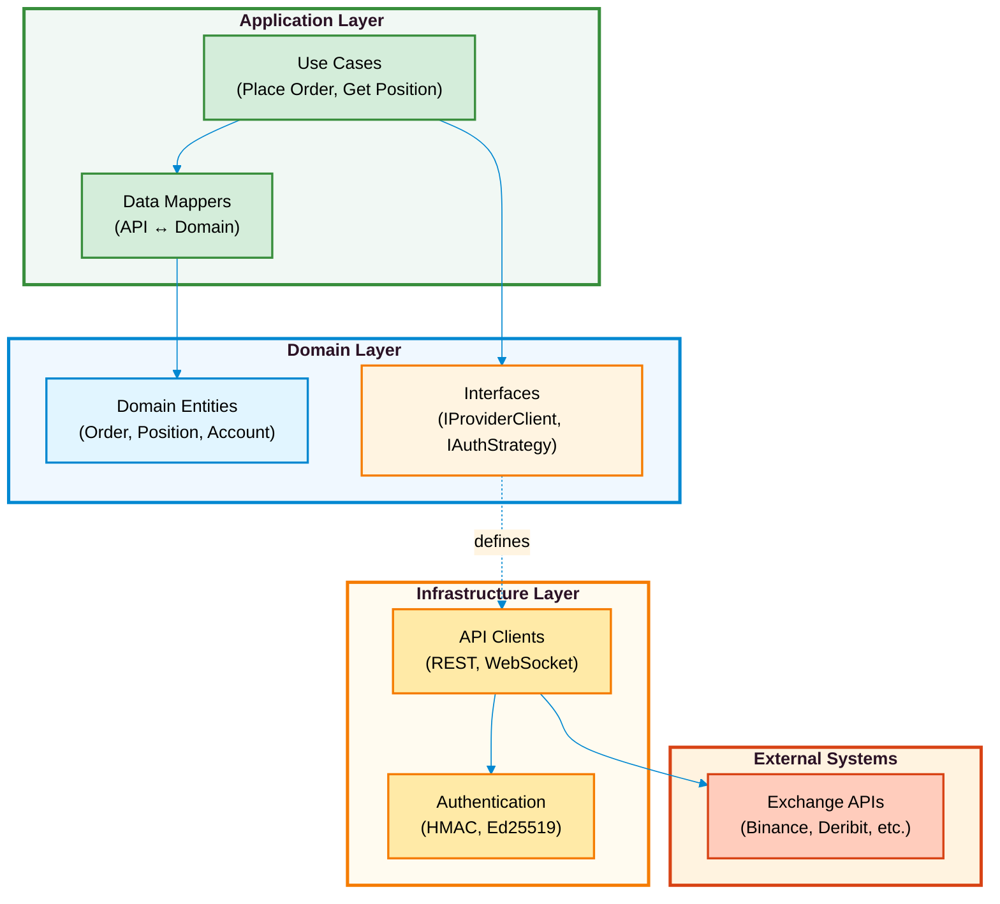
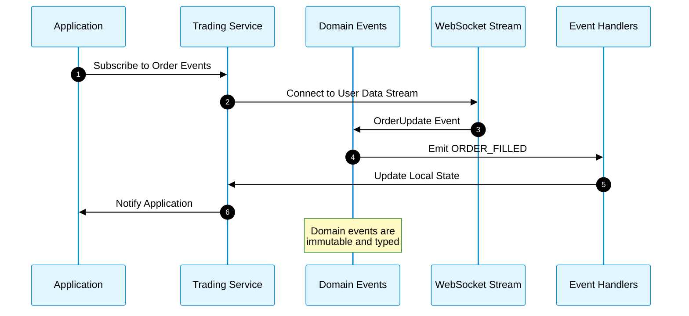
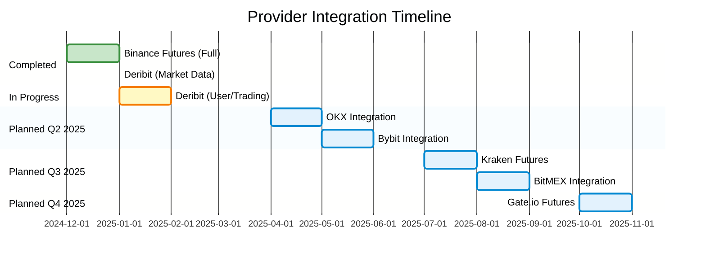
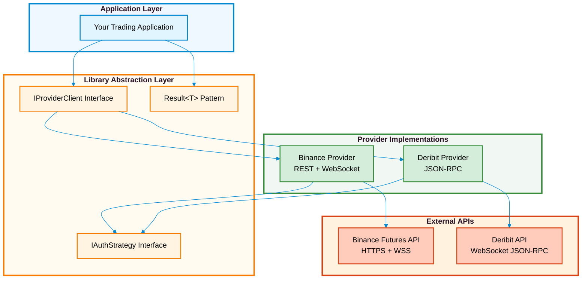
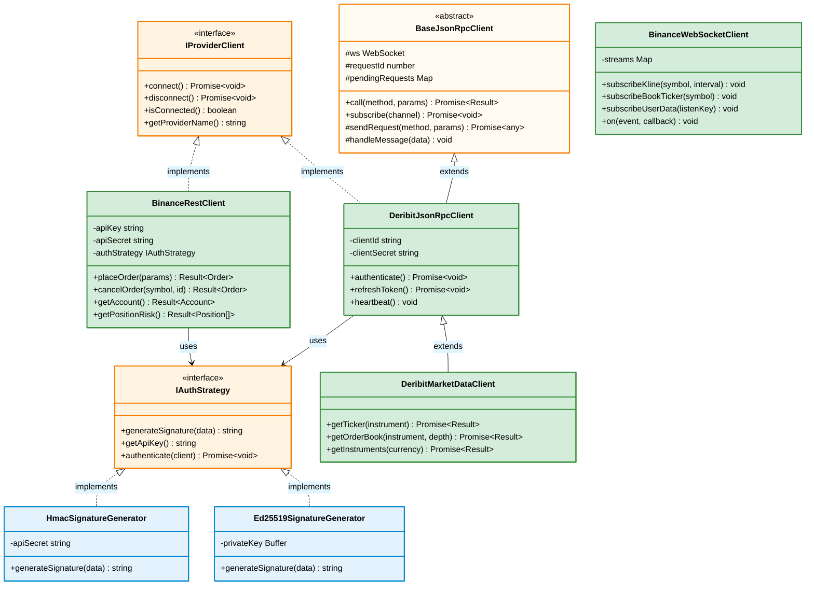
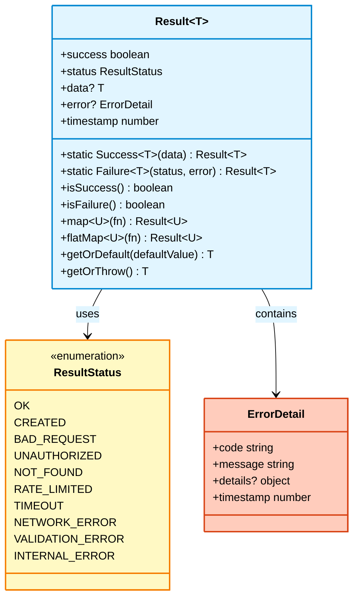
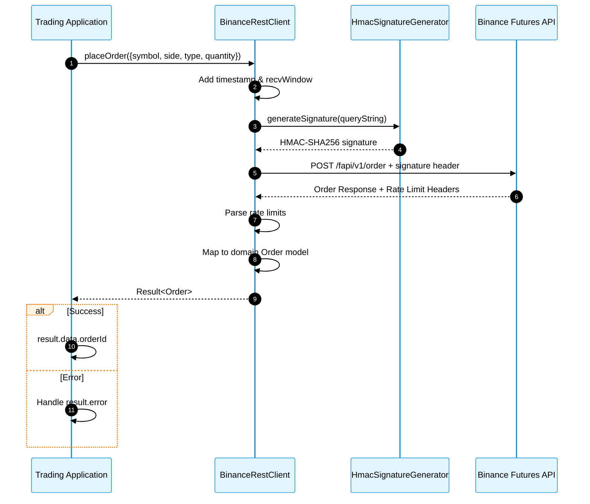
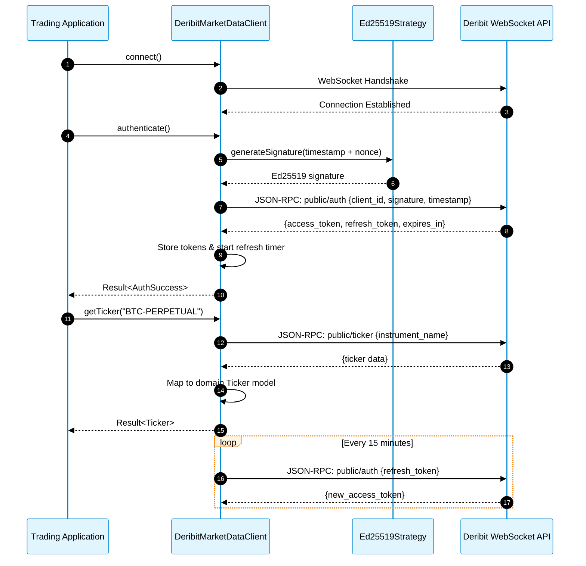
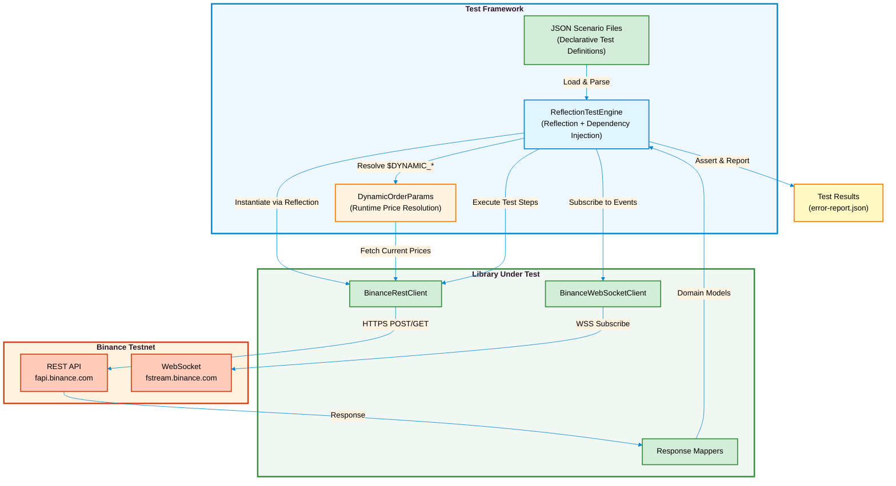
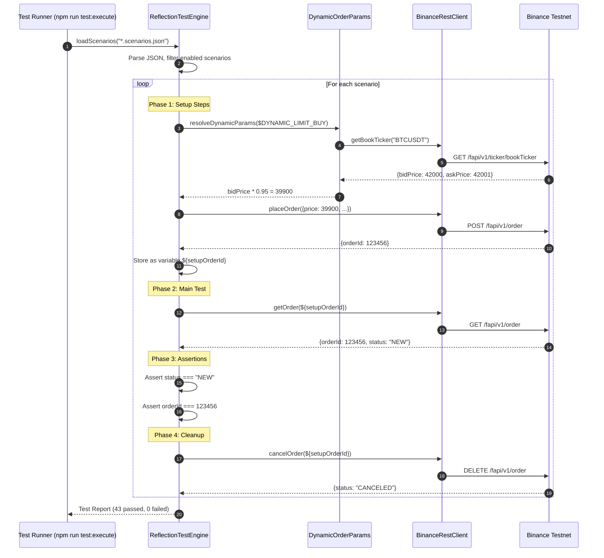

# <i class="fa fa-building"></i> Ark Alliance Trading Providers Library

<div align="center">

[](https://www.npmjs.com/package/ark-alliance-trading-providers-lib)
[](https://www.npmjs.com/package/ark-alliance-trading-providers-lib)
[](https://github.com/ArmandRicheletKleinberg/Ark.Alliance.Trading.Providers.Lib/actions)
[](./src/Ark.Alliance.Trading.Providers.Lib.Test)
[](./src/Ark.Alliance.Trading.Providers.Lib.Test)
[](https://www.typescriptlang.org/)
[](./LICENSE)
[](https://nodejs.org/)

**Production-Ready Multi-Provider Cryptocurrency Trading SDK**

> **<i class="fa fa-box"></i> [Available on npm](https://www.npmjs.com/package/ark-alliance-trading-providers-lib)** - Install with `npm install ark-alliance-trading-providers-lib`

*Organization*: M2H.Io Ark.Alliance Ecosystem  
*Version*: 1.0.0  
*Last Updated*: 2025-12-30

[Installation](#-quick-start) • [Library Documentation](./src/Ark.Alliance.Trading.Providers.Lib/README.md) • [Test Guide](./src/Ark.Alliance.Trading.Providers.Lib.Test/README.md) • [Contributing](./CONTRIBUTING.md)

</div>

---

## <i class="fa fa-question-circle"></i> What is This?

A **production-ready TypeScript SDK** that unifies cryptocurrency trading across multiple exchanges with a single, elegant API. Stop writing exchange-specific code—write once, trade everywhere.

**Perfect for:**
- <i class="fa fa-robot"></i> Algorithmic trading bots
- <i class="fa fa-chart-line"></i> Market data aggregators
- <i class="fa fa-briefcase"></i> Portfolio management systems
- <i class="fa fa-chart-bar"></i> Trading analytics platforms

---

## <i class="fa fa-star"></i> Key Features

| Feature | Description |
|:--------|:------------|
| <i class="fa fa-plug"></i> **Multi-Provider** | Unified interface for Binance Futures and Deribit exchanges |
| <i class="fa fa-chart-line"></i> **Order Management** | Place, modify, cancel, and track orders with standardized API |
| <i class="fa fa-coins"></i> **Position Tracking** | Real-time position monitoring with P&L calculation |
| <i class="fa fa-broadcast-tower"></i> **WebSocket Streams** | Low-latency market data and user event subscriptions |
| <i class="fa fa-bolt"></i> **Event-Driven** | Async event architecture for order fills, position updates |
| <i class="fa fa-check-circle"></i> **Result Pattern** | Type-safe error handling with functional programming paradigm |
| <i class="fa fa-lock"></i> **Secure Auth** | HMAC-SHA256 (Binance) and Ed25519 (Deribit) sign generation |
| <i class="fa fa-flask"></i> **100% Tested** | Comprehensive test suite with 70+ scenarios, 100% pass rate |
| <i class="fa fa-code"></i> **TypeScript-First** | Full type definitions with IntelliSense support |
| <i class="fa fa-globe"></i> **Testnet Support** | Built-in testnet URLs for safe development |

---

## <i class="fa fa-sitemap"></i> Architecture Overview

Clean, modular architecture built on industry-standard patterns:



> **<i class="fa fa-book"></i> For detailed architecture diagrams and patterns**, see [Library Documentation](./src/Ark.Alliance.Trading.Providers.Lib/README.md)

---



### Basic Usage

```typescript
import { BinanceRestClient } from 'ark-alliance-trading-providers-lib/Binance';

// Initialize client
const client = new BinanceRestClient(apiKey, secret, { testnet: true });

// Place order with type-safe Result pattern
const orderResult = await client.placeOrder({
  symbol: 'BTCUSDT',
  side: 'BUY',
  type: 'MARKET',
  quantity: 0.001
});

if (orderResult.success) {
  console.log(`Order placed! ID: ${orderResult.data.orderId}`);
} else {
  console.error(`Error: ${orderResult.error.message}`);
}
```

> **<i class="fa fa-code"></i> For complete API reference and advanced examples**, see [Library Documentation](./src/Ark.Alliance.Trading.Providers.Lib/README.md)

---

## <i class="fa fa-map"></i> Roadmap



> **<i class="fa fa-tasks"></i> For detailed roadmap and milestones**, see [ROADMAP.md](./ROADMAP.md)

---

## <i class="fa fa-book-open"></i> Documentation

| Document | Description |
|:---------|:------------|
| **[<i class="fa fa-book"></i> Library API](./src/Ark.Alliance.Trading.Providers.Lib/README.md)** | Complete API reference, detailed architecture, integration guides |
| **[<i class="fa fa-flask"></i> Test Guide](./src/Ark.Alliance.Trading.Providers.Lib.Test/RE ADME.md)** | Test architecture, scenario-based testing, 70+ test scenarios |
| **[<i class="fa fa-users"></i> Contributing](./CONTRIBUTING.md)** | Coding standards, PR process, adding new providers |
| **[<i class="fa fa-rocket"></i> Deployment](./Deployments/npm-publishing.md)** | NPM publishing guide, versioning strategy |
| **[<i class="fa fa-github"></i> GitHub Setup](./GITHUB_SETUP.md)** | Branch protection, CI/CD workflows |

---

## <i class="fa fa-folder-tree"></i> Project Structure

```
Ark.Alliance.Trading.Providers.Lib/
├── src/
│   ├── Ark.Alliance.Trading.Providers.Lib/    # Main library
│   │   ├── Src/
│   │   │   ├── Binance/                       # Binance provider
│   │   │   ├── Deribit/                       # Deribit provider
│   │   │   └── Common/                        # Shared utilities
│   │   └── README.md                          # 📚 DETAILED API DOCS
│   │
│   └── Ark.Alliance.Trading.Providers.Lib.Test/  # Test suite
│       └── README.md                              # 🧪 TESTING GUIDE
│
├── Deployments/                               # Deployment guides
├── Scripts/                                   # Build scripts
└── README.md                                  # ⬅️ You are here
```

> **<i class="fa fa-arrow-right"></i> See [Library Documentation](./src/Ark.Alliance.Trading.Providers.Lib/README.md) for detailed module breakdown**

---

## <i class="fa fa-users"></i> Contributing

### Multi-Provider Design

The library uses a **provider abstraction pattern** to ensure consistent behavior across different exchanges while respecting each provider's unique protocols.



### Base Class Mechanism

Abstract base classes provide shared functionality across providers:



### Result Pattern

All API operations return a `Result<T>` object for consistent, type-safe error handling:



### Architecture Diagrams

#### Order Placement Flow (Binance)



#### WebSocket Authentication & Subscription Flow (Deribit)



---

## <i class="fa fa-pen"></i> Author

**Armand Richelet Kleinberg**  
M2H.Io Ark.Alliance Ecosystem

---

## <i class="fa fa-file-contract"></i> License

MIT License - see [LICENSE](./LICENSE) file for details

### Test Architecture



### Test Coverage

| Scenario File | Category | Scenarios | Pass Rate | Description |
|:--------------|:---------|:---------:|:---------:|:------------|
| `account.scenarios.json` | Account | 8 | ✅ 100% | Account info, balance, positions, commission rates |
| `market-data.scenarios.json` | Market Data | 8 | ✅ 100% | Prices, order book, klines, funding rates |
| `orders.scenarios.json` | Orders | 12 | ✅ 92% | Limit, market, stop orders (2 disabled) |
| `positions.scenarios.json` | Positions | 14 | ✅ 100% | Open/close positions, leverage, margin settings |
| `gtx-orders.scenarios.json` | Post-Only (GTX) | 13 | ✅ 100% | Maker-only orders with event validation |
| `market-orders.scenarios.json` | Market Orders | 8 | ✅ 100% | Market execution workflows |
| `algo-orders.scenarios.json` | Algo Orders | 10 | ✅ 100% | Stop-loss, take-profit, trailing stops |
| `mixed-orders.scenarios.json` | Mixed Workflows | 10 | ✅ 100% | Complex multi-order scenarios |
| **Total** | **All Categories** | **70+** | **✅ 100%** | **Comprehensive coverage** |

> [!NOTE]
> **Testnet Requirement**: Order/position/account tests require Binance Testnet credentials. Market data tests run without authentication using public APIs.

**Test Execution Flow**:



For complete test documentation, see [Test Project README](./src/Ark.Alliance.Trading.Providers.Lib.Test/README.md).

---

<div align="center">

**Built with <i class="fa fa-heart"></i> for the algorithmic trading community**

[<i class="fa fa-box"></i> npm](https://www.npmjs.com/package/ark-alliance-trading-providers-lib) • [<i class="fa fa-github"></i> GitHub](https://github.com/ArmandRicheletKleinberg/Ark.Alliance.Trading.Providers.Lib) • [<i class="fa fa-bug"></i> Issues](https://github.com/ArmandRicheletKleinberg/Ark.Alliance.Trading.Providers.Lib/issues)

</div>
