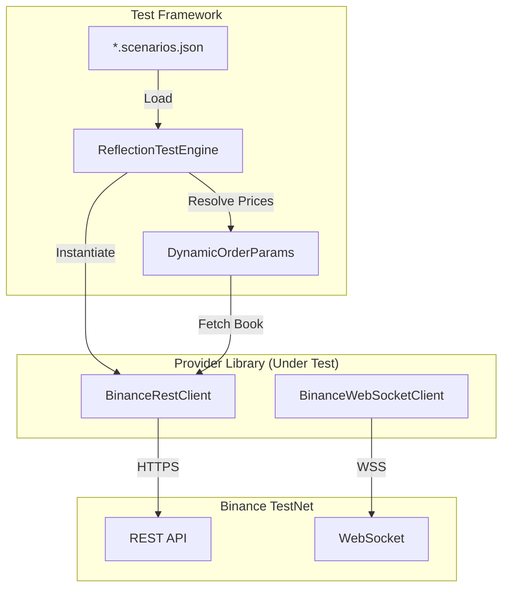
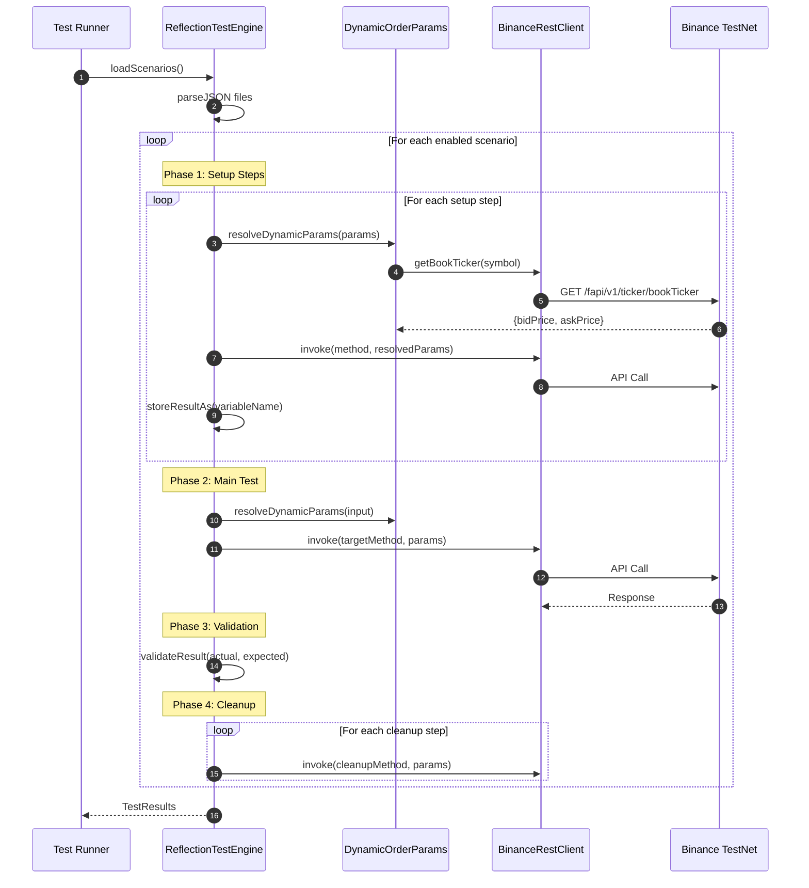

# Ark Alliance Trading Providers Library - Automated Test Project

**Organization**: M2H.Io Ark.Alliance Ecosystem  
**Version**: 1.0.0  
**Last Updated**: 2026-01-06

---

## 📊 Test Results Summary

| Metric | Value |
|:-------|:------|
| **Pass Rate** | 100% |
| **Passed** | 88 |
| **Failed** | 0 |
| **Skipped** | 7 |
| **Total Scenarios** | 100+ across 11 scenario files |

---

## Table of Contents

1. [Prerequisites](#prerequisites)
2. [Testnet Environment Setup](#testnet-environment-setup)
3. [Architecture](#architecture)
4. [Test Execution Flow](#test-execution-flow)
5. [Scenario Files](#scenario-files)
6. [Complete Scenario List](#complete-scenario-list)
7. [Deribit Tests](#deribit-tests)
8. [Dynamic Parameters](#dynamic-parameters)
9. [Running Tests](#running-tests)

---

## Prerequisites

### API Credentials Requirements

| Provider | Required For | Credentials | Access Level |
|:---------|:-------------|:------------|:-------------|
| **Binance** | Orders, Positions, Account tests | API Key + Secret | **TESTNET** |
| **Deribit** | Trading tests (future) | Client ID + Secret | **TESTNET** |
| **Kraken** | Trading tests | API Key + Secret | **TESTNET (Demo)** |
| *None* | Market Data tests | *None* | Public API |

> [!IMPORTANT]
> **Market data tests do NOT require credentials** - they use public APIs.
> Only order/position/account tests require testnet credentials.

---

## Testnet Environment Setup

### Binance Futures Testnet

| Resource | URL |
|:---------|:----|
| **Testnet Portal** | https://testnet.binancefuture.com |
| **API Documentation** | https://binance-docs.github.io/apidocs/futures/en |
| **WebSocket Base** | `wss://stream.binancefuture.com` |
| **REST Base** | `https://testnet.binancefuture.com` |

**Steps to get Binance Testnet credentials:**
1. Go to https://testnet.binancefuture.com
2. Log in with GitHub account
3. Navigate to "API Management" in the top menu
4. Click "Create API" → Save the API Key and Secret

### Deribit Testnet

| Resource | URL |
|:---------|:----|
| **Testnet Portal** | https://test.deribit.com |
| **API Documentation** | https://docs.deribit.com |
| **WebSocket Base** | `wss://test.deribit.com/ws/api/v2` |

**Steps to get Deribit Testnet credentials:**
1. Go to https://test.deribit.com
2. Create an account (separate from mainnet)
3. Navigate to Account → API Management
4. Create new API key with required scopes
5. Save the Client ID and Client Secret

### Environment Variables

Create a `.env.test` file in the project root:

```bash
# Binance Testnet
BINANCE_API_KEY=your_binance_testnet_api_key
BINANCE_API_SECRET=your_binance_testnet_api_secret

# Deribit Testnet
DERIBIT_CLIENT_ID=your_deribit_client_id
DERIBIT_CLIENT_SECRET=your_deribit_client_secret

# Kraken Futures Testnet (Demo)
KRAKEN_API_KEY=your_kraken_api_key
KRAKEN_API_SECRET=your_kraken_api_secret

# Test Configuration
RUN_LIVE_TESTS=true      # Enable live API tests
DEBUG=true               # Enable debug logging
```

> [!TIP]
> For CI/CD, set these as repository secrets and inject them as environment variables.

---

## Architecture



---

## Test Execution Flow



---

## Scenario Files

| File | Category | Count | Description |
|:-----|:---------|:-----:|:------------|
| `account.scenarios.json` | Account | 8 | Account info, balance, positions, commission |
| `market-data.scenarios.json` | Market Data | 8 | Prices, order book, klines, funding rates |
| `orders.scenarios.json` | Orders | 12 | Limit, market, cancel, order lifecycle |
| `positions.scenarios.json` | Positions | 14 | Open/close, leverage, margin type |
| `gtx-orders.scenarios.json` | GTX | 13 | Post-Only orders with event validation |
| `market-orders.scenarios.json` | Market | 8 | Market order workflows |
| `algo-orders.scenarios.json` | Algo | 10 | Stop, take-profit, trailing stop |
| `mixed-orders.scenarios.json` | Mixed | 10 | Multi-type order combinations |
| **Kraken/** `market-data.scenarios.json` | Kraken REST | 14 | Tickers, order books, trades, instruments |
| **Kraken/** `streaming.scenarios.json` | Kraken WebSocket | 15 | WebSocket streams, subscriptions, authentication |
| **Deribit/** `market-data.scenarios.json` | Deribit Market | 8 | Ticker, order book, instruments |

---

## Complete Scenario List

### 📁 account.scenarios.json

| ID | Name | Status | Test Sequence |
|:---|:-----|:------:|:--------------|
| ACC-001 | Get Account Info | ✅ PASS | `getAccountInfo()` → Validate success and account structure |
| ACC-002 | Get Balance | ✅ PASS | `getBalance()` → Validate array of balances returned |
| ACC-003 | Get Positions | ✅ PASS | `getPositionRisk()` → Validate position array structure |
| ACC-004 | Get Open Orders | ✅ PASS | `getOpenOrders("BTCUSDT")` → Validate orders array |
| ACC-005 | Get Trade History | ✅ PASS | `getUserTrades("BTCUSDT", {limit: 5})` → Validate trades array |
| ACC-006 | Get Commission Rate | ✅ PASS | `getCommissionRate("BTCUSDT")` → Validate maker/taker fees |
| ACC-007 | Get Income History | ✅ PASS | `getIncome()` → Validate income array |
| ACC-008 | Get Leverage Brackets | ✅ PASS | `getLeverageBracket("BTCUSDT")` → Validate bracket structure |

---

### 📁 market-data.scenarios.json

| ID | Name | Status | Test Sequence |
|:---|:-----|:------:|:--------------|
| MKT-001 | Get Price | ✅ PASS | `getPrice("BTCUSDT")` → Validate price returned |
| MKT-002 | Get All Prices | ✅ PASS | `getAllPrices()` → Validate array of all prices |
| MKT-003 | Get Order Book | ✅ PASS | `getOrderBook("BTCUSDT", 20)` → Validate bids/asks |
| MKT-004 | Get Klines | ✅ PASS | `getKlines("BTCUSDT", "1h", 100)` → Validate candlestick data |
| MKT-005 | Get Book Ticker | ✅ PASS | `getBookTicker("BTCUSDT")` → Validate bid/ask prices |
| MKT-006 | Get 24hr Ticker | ✅ PASS | `get24hrTicker("BTCUSDT")` → Validate 24h stats |
| MKT-007 | Get Exchange Info | ✅ PASS | `getExchangeInfo()` → Validate symbol rules |
| MKT-008 | Get Funding Rate | ✅ PASS | `getFundingRate("BTCUSDT")` → Validate funding data |

---

### 📁 orders.scenarios.json

| ID | Name | Status | Test Sequence |
|:---|:-----|:------:|:--------------|
| ORD-001 | Place Limit Buy | ✅ PASS | 1. `placeOrder(LIMIT, BUY)` → 2. Validate order ID → 3. Cleanup: cancel order |
| ORD-002 | Cancel Order | ✅ PASS | 1. Setup: place limit order → 2. `cancelOrder()` → 3. Validate status=CANCELED |
| ORD-003 | Get Order Status | ✅ PASS | 1. Setup: place order → 2. `getOrder()` → 3. Validate order details |
| ORD-004 | Place Market Buy | ✅ PASS | 1. `placeOrder(MARKET, BUY)` → 2. Validate status=FILLED → 3. Cleanup: close position |
| ORD-005 | Place Stop Market | ✅ PASS | 1. `placeOrder(STOP_MARKET)` → 2. Validate order placed → 3. Cleanup: cancel |
| ORD-006 | Place Limit Sell | ✅ PASS | 1. `placeOrder(LIMIT, SELL)` → 2. Validate → 3. Cancel |
| ORD-007 | Cancel All Orders | ✅ PASS | 1. Setup: place 2 orders → 2. `cancelAllOpenOrders()` → 3. Validate all cancelled |
| ORD-008 | Get Open Orders | ✅ PASS | 1. Setup: place order → 2. `getOpenOrders()` → 3. Validate order in list |
| ORD-009 | Place Market Sell | ✅ PASS | 1. Setup: open long → 2. `placeOrder(MARKET, SELL)` → 3. Validate closed |
| ORD-010 | FOK Order | ⏭️ SKIP | Disabled - Dynamic price resolution pending fix |
| ORD-011 | GTD Order | ⏭️ SKIP | Disabled - Dynamic timestamp resolution pending fix |
| ORD-012 | Trailing Stop | ✅ PASS | 1. Setup: open position → 2. Place trailing stop → 3. Validate → 4. Cleanup |

---

### 📁 positions.scenarios.json

| ID | Name | Status | Test Sequence |
|:---|:-----|:------:|:--------------|
| POS-001 | Open Long Position | ✅ PASS | 1. `placeOrder(MARKET, BUY)` → 2. Validate FILLED → 3. Close position |
| POS-002 | Open Short Position | ✅ PASS | 1. `placeOrder(MARKET, SELL)` → 2. Validate FILLED → 3. Close position |
| POS-003 | Close Long Position | ✅ PASS | 1. Setup: open long → 2. `placeOrder(SELL, reduceOnly)` → 3. Validate closed |
| POS-004 | Close Short Position | ✅ PASS | 1. Setup: open short → 2. `placeOrder(BUY, reduceOnly)` → 3. Validate closed |
| POS-005 | Partial Close | ✅ PASS | 1. Setup: open 0.003 → 2. Close 0.001 → 3. Validate remaining 0.002 |
| POS-006 | Full Close Position | ✅ PASS | 1. Setup: open position → 2. Close with reduceOnly → 3. Validate |
| POS-007 | Get Position Risk | ✅ PASS | 1. Setup: open position → 2. `getPositionRisk()` → 3. Validate position data |
| POS-008 | Set Leverage | ✅ PASS | `setLeverage("BTCUSDT", 20)` → Validate leverage=20 |
| POS-009 | Set Margin Isolated | ✅ PASS | `setMarginType("BTCUSDT", "ISOLATED")` → Validate (allows -4046) |
| POS-010 | Set Margin Cross | ✅ PASS | `setMarginType("ETHUSDT", "CROSSED")` → Validate (allows -4046) |
| POS-011 | Get Position Mode | ✅ PASS | `getPositionMode()` → Validate dualSidePosition field |
| POS-012 | Position with SL | ✅ PASS | 1. Open long → 2. Add stop loss → 3. Validate both → 4. Cleanup |
| POS-013 | Position with TP | ✅ PASS | 1. Open long → 2. Add take profit → 3. Validate → 4. Cleanup |
| POS-014 | Modify Position Amount | ✅ PASS | 1. Open position → 2. Modify margin → 3. Validate |

---

### 📁 gtx-orders.scenarios.json

| ID | Name | Status | Test Sequence |
|:---|:-----|:------:|:--------------|
| GTX-001 | GTX Buy Order | ✅ PASS | 1. `placeOrder(LIMIT, GTX, BUY)` @ bid*0.999 → 2. Validate status=NEW, timeInForce=GTX → 3. Cancel |
| GTX-002 | GTX Sell Order | ✅ PASS | 1. `placeOrder(LIMIT, GTX, SELL)` @ ask*1.001 → 2. Validate → 3. Cancel |
| GTX-003 | GTX Buy ETH | ✅ PASS | 1. `placeOrder` on ETHUSDT → 2. Validate GTX → 3. Cancel |
| GTX-004 | GTX Sell ETH | ✅ PASS | 1. `placeOrder` on ETHUSDT → 2. Validate → 3. Cancel |
| GTX-005 | GTX Rejection Test | ✅ PASS | 1. `placeOrder(GTX)` with marketable price → 2. Expect rejection (-5022) |
| GTX-006 | GTX Status Check | ✅ PASS | 1. Setup: place GTX → 2. `getOrder()` → 3. Validate status=NEW |
| GTX-007 | GTX Cancel Flow | ✅ PASS | 1. Setup: place GTX → 2. `cancelOrder()` → 3. Validate CANCELED |
| GTX-008 | GTX Ladder | ✅ PASS | 1. Setup: place 1st GTX → 2. Place 2nd at deeper price → 3. Cancel all |
| GTX-009 | GTX Event Validation | ✅ PASS | 1. Place GTX → 2. Wait for orderUpdate event → 3. Validate event data |
| GTX-010 | Single Cancel | ✅ PASS | 1. Setup: place GTX → 2. `cancelOrder(orderId)` → 3. Validate |
| GTX-011 | Batch Cancel All | ✅ PASS | 1. Setup: place 3 GTX orders → 2. `cancelAllOpenOrders()` → 3. Validate |
| GTX-012 | Position Event Check | ✅ PASS | 1. Setup: open position → 2. Place GTX reduceOnly → 3. Check events → 4. Cleanup |
| GTX-013 | Multi-Symbol Batch | ✅ PASS | 1. Setup: BTC GTX → 2. Place ETH GTX → 3. Cancel both symbols |

---

### 📁 market-orders.scenarios.json

| ID | Name | Status | Test Sequence |
|:---|:-----|:------:|:--------------|
| MKT-ORD-001 | Market Buy Basic | ✅ PASS | 1. `placeOrder(MARKET, BUY)` → 2. Validate FILLED → 3. Close position |
| MKT-ORD-002 | Market Sell Basic | ✅ PASS | 1. Setup: open long → 2. `placeOrder(MARKET, SELL, reduceOnly)` → 3. Validate |
| MKT-ORD-003 | Market Order ETH | ✅ PASS | 1. `placeOrder` on ETHUSDT → 2. Validate FILLED → 3. Close |
| MKT-ORD-004 | Market with Events | ✅ PASS | 1. Place market → 2. Wait for orderUpdate event → 3. Validate → 4. Cleanup |
| MKT-ORD-005 | Position Check After Fill | ✅ PASS | 1. Setup: market order → 2. `getPosition()` → 3. Validate position exists |
| MKT-ORD-006 | Market ReduceOnly | ✅ PASS | 1. Setup: open position → 2. Market close with reduceOnly → 3. Validate |
| MKT-ORD-007 | Short Position | ✅ PASS | 1. `placeOrder(MARKET, SELL)` → 2. Validate short position → 3. Close |
| MKT-ORD-008 | Round Trip | ✅ PASS | 1. Setup: market buy → 2. Market sell → 3. Validate full lifecycle |

---

### 📁 algo-orders.scenarios.json

| ID | Name | Status | Test Sequence |
|:---|:-----|:------:|:--------------|
| ALGO-001 | Stop Market Buy | ✅ PASS | 1. `placeOrder(STOP_MARKET, BUY)` @ price*1.05 → 2. Validate NEW → 3. Cancel |
| ALGO-002 | Stop Market Sell (SL) | ✅ PASS | 1. Setup: open long → 2. Place stop @ price*0.95 → 3. Validate → 4. Cleanup |
| ALGO-003 | Take Profit Market | ✅ PASS | 1. Setup: open long → 2. Place TP @ price*1.05 → 3. Validate → 4. Cleanup |
| ALGO-004 | Trailing Stop | ✅ PASS | 1. Setup: open long → 2. `placeOrder(TRAILING_STOP_MARKET, callbackRate=1.0)` → 3. Validate → 4. Cleanup |
| ALGO-005 | SL + TP Bracket | ✅ PASS | 1. Setup: open long → 2. Add SL → 3. Add TP → 4. Validate both → 5. Cleanup |
| ALGO-006 | Algo Cancel Single | ✅ PASS | 1. Setup: place stop → 2. `cancelOrder()` → 3. Validate CANCELED |
| ALGO-007 | Algo Batch Cancel | ✅ PASS | 1. Setup: place 2 stops → 2. `cancelAllOpenOrders()` → 3. Validate |
| ALGO-008 | Algo Event Validation | ✅ PASS | 1. Place stop → 2. Wait for orderUpdate event → 3. Validate event data → 4. Cancel |
| ALGO-009 | Stop Status Check | ✅ PASS | 1. Setup: place stop → 2. `getOrder()` → 3. Validate status=NEW, type=STOP_MARKET |
| ALGO-010 | Multi-Symbol Algo | ✅ PASS | 1. Setup: BTC stop → 2. Place ETH stop → 3. Cancel both symbols |

---

### 📁 mixed-orders.scenarios.json

| ID | Name | Status | Test Sequence |
|:---|:-----|:------:|:--------------|
| MIX-001 | GTX + Stop Loss | ✅ PASS | 1. Setup: place GTX entry → 2. Place stop loss → 3. Validate both → 4. Cancel all |
| MIX-002 | Batch GTX Both Sides | ✅ PASS | 1. Setup: 2 BUY GTX → 2. Setup: 1 SELL GTX → 3. Place 2nd SELL → 4. Cancel all 4 |
| MIX-003 | Successive Algo Orders | ✅ PASS | 1. Setup: open 0.003 → 2. Add SL (0.001) → 3. Add TP (0.001) → 4. Add trailing (0.001) → 5. Cleanup |
| MIX-004 | Order Update (Modify) | ✅ PASS | 1. Setup: place limit → 2. `modifyOrder()` with new price → 3. Validate → 4. Cancel |
| MIX-005 | Cancel with Event | ✅ PASS | 1. Setup: place order → 2. Cancel → 3. Validate orderUpdate event with CANCELED |
| MIX-006 | Position Event After Fill | ✅ PASS | 1. Market order → 2. Wait for orderUpdate (FILLED) → 3. Wait for positionUpdate → 4. Close |
| MIX-007 | Multi-Symbol Mixed | ✅ PASS | 1. Setup: BTC GTX → 2. Place ETH stop → 3. Validate both → 4. Cancel both symbols |
| MIX-008 | Complete Bracket Lifecycle | ✅ PASS | 1. Market entry → 2. Add GTX TP → 3. Add stop SL → 4. `cancelAllOpenOrders()` → 5. Close position |
| MIX-009 | Short Side Orders | ✅ PASS | 1. Open short → 2. Add BUY stop loss → 3. Add BUY take profit → 4. Cleanup |
| MIX-010 | Order Event Sequence | ✅ PASS | 1. Setup: place limit → 2. `getOrder()` → 3. Validate status=NEW → 4. Cancel |

---

## Kraken Tests

### 📁 Kraken/market-data.scenarios.json

| ID | Name | Status | Test Sequence |
|:---|:-----|:------:|:--------------|
| KMD-001 | Get Instruments List | ✅ PASS | `getInstruments()` → Validate instruments array |
| KMD-002 | Get Tickers | ✅ PASS | `getTickers()` → Validate tickers array |
| KMD-003 | Get Specific Ticker | ✅ PASS | `getTicker('PI_XBTUSD')` → Validate instrument, lastPrice |
| KMD-004 | Get Ticker - Invalid Symbol | ✅ PASS | `getTicker('INVALID')` → Expect NOT_FOUND error |
| KMD-005 | Get Order Book | ✅ PASS | `getOrderBook('PI_XBTUSD')` → Validate bids/asks |
| KMD-006 | Get Order Book via Service | ✅ PASS | `getOrderBook('PI_XBTUSD', 20)` → Validate depth |
| KMD-007 | Get Trade History | ✅ PASS | `getHistory('PI_XBTUSD')` → Validate history array |
| KMD-008 | Get Recent Trades via Service | ✅ PASS | `getRecentTrades('PI_XBTUSD', 50)` → Validate array |
| KMD-009 | Get Instrument Info | ✅ PASS | `getInstrument('PI_XBTUSD')` → Validate symbol, type |
| KMD-010 | Get Instruments with Filter | ✅ PASS | `getInstruments({type: 'perpetual'})` → Validate array |
| KMD-011 | Get ETH Perpetual Ticker | ✅ PASS | `getTicker('PI_ETHUSD')` → Validate ETH ticker |
| KMD-012 | Service Connect/Disconnect | ✅ PASS | `connect()` → `disconnect()` lifecycle |
| KMD-013 | NOT_CONNECTED Error | ✅ PASS | Call before connect → Expect NOT_CONNECTED |
| KMD-014 | Get Multiple Tickers | ✅ PASS | BTC, ETH, SOL tickers → Validate all |

### 📁 Kraken/streaming.scenarios.json

| ID | Name | Status | Test Sequence |
|:---|:-----|:------:|:--------------|
| KWS-001 | Subscribe to Ticker | ✅ PASS | `subscribeToFeed('ticker', 'PI_XBTUSD')` → Expect ticker event |
| KWS-002 | Multiple Ticker Streams | ✅ PASS | Subscribe BTC, ETH, SOL → Validate all tickers |
| KWS-003 | Order Book Stream | ✅ PASS | `subscribeToFeed('book')` → Expect book_snapshot |
| KWS-004 | Trade Stream | ✅ PASS | `subscribeToFeed('trade')` → Expect trade event |
| KWS-005 | Quote via Service | ✅ PASS | `subscribeQuote()` → Validate subscription handle |
| KWS-006 | Ticker via Service | ✅ PASS | `subscribeTicker()` → Validate handle |
| KWS-007 | Order Book via Service | ✅ PASS | `subscribeOrderBook()` → Validate handle |
| KWS-008 | Trades via Service | ✅ PASS | `subscribeTrades()` → Validate handle |
| KWS-009 | Connect/Disconnect | ✅ PASS | WebSocket lifecycle test |
| KWS-010 | Get Active Subscriptions | ✅ PASS | Subscribe → `getSubscriptions()` → Validate count |
| KWS-011 | Reconnect Test | ✅ PASS | Connect → Subscribe → Verify connected state |
| KWS-012 | Private Fills Feed | ✅ PASS | Authenticated `fills` subscription (requires API key) |
| KWS-013 | Private Orders Feed | ✅ PASS | Authenticated `open_orders` subscription |
| KWS-014 | Private Positions Feed | ✅ PASS | Authenticated `open_positions` subscription |
| KWS-015 | Unsubscribe All | ✅ PASS | `unsubscribeAll()` → Validate cleanup |

### Kraken Test Status Summary

| Category | Status | Tests | Notes |
|:---------|:------:|:-----:|:------|
| Market Data REST | ✅ | 14 | Fully implemented - no credentials required |
| WebSocket Streaming | ✅ | 15 | Public feeds - no credentials required |
| Private Feeds | ✅ | 3 | Requires Kraken Demo API credentials |
| Trading | ⏳ | 0 | Implementation complete, tests planned |

---

## Deribit Tests

### 📁 Deribit/market-data.scenarios.json

| ID | Name | Status | Test Sequence |
|:---|:-----|:------:|:--------------|
| DRB-001 | Initial State | ✅ PASS | Validate disconnected initially, provider=DERIBIT |
| DRB-002 | NOT_CONNECTED Error | ✅ PASS | `getTicker()` before connect → Expect NOT_CONNECTED error |
| DRB-003 | Connect to Testnet | ✅ PASS | `connect()` → Validate isConnected=true |
| DRB-004 | Disconnect Gracefully | ✅ PASS | `connect()` → `disconnect()` → Validate isConnected=false |
| DRB-005 | Get BTC Ticker | ✅ PASS | `getTicker('BTC-PERPETUAL')` → Validate lastPrice, instrument |
| DRB-006 | Get ETH Ticker | ✅ PASS | `getTicker('ETH-PERPETUAL')` → Validate ticker data |
| DRB-007 | Get Order Book | ✅ PASS | `getOrderBook('BTC-PERPETUAL', 10)` → Validate bids/asks |
| DRB-008 | Get Instrument Info | ✅ PASS | `getInstrument('BTC-PERPETUAL')` → Validate symbol, type |
| DRB-009 | Get Instruments List | ✅ PASS | `getInstruments({baseCurrency: 'BTC'})` → Validate array |
| DRB-010 | Subscribe Quote | ✅ PASS | `subscribeQuote()` → Validate subscription handle |

### Deribit Test Status Summary

| Category | Status | Tests | Notes |
|:---------|:------:|:-----:|:------|
| Market Data | ✅ | 15 | Fully implemented - no credentials required |
| Account/Positions | ⏳ | 0 | **Not yet implemented** |
| Order Placement | ⏳ | 0 | **Not yet implemented** |
| Order Cancellation | ⏳ | 0 | **Not yet implemented** |

> [!NOTE]
> Deribit trading tests (account, positions, orders) require authenticated API access and are planned for future implementation.

---

## Dynamic Parameters

The test engine supports special parameter tags that are resolved at runtime:

| Tag | Calculation | Use Case |
|:----|:------------|:---------|
| `$DYNAMIC_LIMIT_BUY` | `askPrice * 0.95` | Limit buys that rest on book |
| `$DYNAMIC_LIMIT_SELL` | `bidPrice * 1.05` | Limit sells that rest on book |
| `$DYNAMIC_GTX_BUY` | `bidPrice * 0.999` | Post-Only buy (maker only) |
| `$DYNAMIC_GTX_SELL` | `askPrice * 1.001` | Post-Only sell (maker only) |
| `$DYNAMIC_STOP_BUY` | `currentPrice * 1.05` | Stop trigger above market |
| `$DYNAMIC_STOP_SELL` | `currentPrice * 0.95` | Stop trigger below market |
| `$DYNAMIC_MIN_NOTIONAL` | Min qty for $105 value | Minimum order size |

---

## Running Tests

```bash
# Run all tests
npm run test:execute

# Run with verbose output
npm run test:verbose

# View error report
cat error-report.json
```

---

**Armand Richelet-Kleinberg**  
IA Solution & Software Architect - Fullstack Devloper  
M2H.Io 
Ark.Alliance Ecosystem

---

*© 2025 M2H.Io Ark.Alliance. All Rights Reserved.*