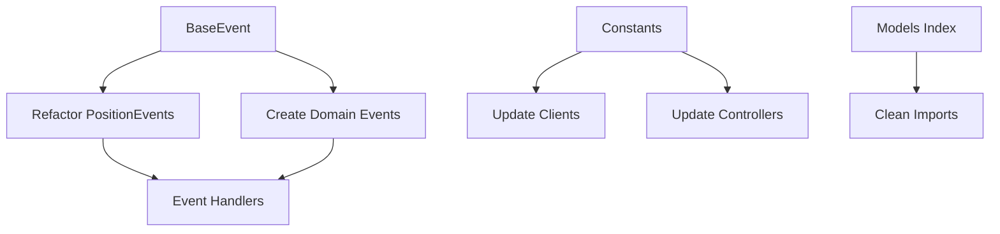

# Binance Provider Library - Audit & Implementation Plan

> **Document Version:** 1.1  
> **Date:** 2025-12-29  
> **Scope:** `Ark.Alliance.Trading.Providers.Lib/src/Binance`  
> **Status:** ✅ Phases 1-3 Complete | Phase 4 (Unit Tests) Pending

---

## Table of Contents

1. [Executive Summary](#1-executive-summary)
2. [AS-IS Analysis](#2-as-is-analysis)
   - [Current Architecture](#21-current-architecture)
   - [Current Models and Responsibilities](#22-current-models-and-responsibilities)
   - [Event System Usage](#23-event-system-usage)
   - [Identified Issues](#24-identified-issues)
3. [TO-BE Design](#3-to-be-design)
   - [Target Architecture](#31-target-architecture)
   - [New/Refactored Models](#32-newrefactored-models)
   - [Responsibility Structure](#33-responsibility-structure)
4. [Gap Analysis & TODO List](#4-gap-analysis--todo-list)
5. [Implementation Plan](#5-implementation-plan)
6. [Risk Points & Considerations](#6-risk-points--considerations)


---

## 1. Executive Summary

This document provides a comprehensive audit of the Binance provider library, analyzing the current state, identifying gaps, and proposing a implementation plan to create a robust, maintainable, and fully-featured Binance Futures provider.

### Current State Overview

| Category | Count | Status |
|----------|-------|--------|
| WebSocket Clients | 4 | ✅ Well-implemented |
| REST Clients | 2 | ✅ Functional |
| Models | 11 | ⚠️ Partially complete |
| Controllers | 6 | ✅ Functional |
| Utils | 4 | ✅ Good |
| Tests | 0 | ❌ Missing |
| Event Base Class | 0 | ❌ Missing |

---

## 2. AS-IS Analysis

### 2.1 Current Architecture

```
src/Binance/
├── clients/                      # Infrastructure Layer
│   ├── Base/
│   │   ├── BaseModels/
│   │   │   ├── _WebSocketClientConfig.ts
│   │   │   └── _WebSocketStats.ts
│   │   └── _BaseWebSocketClient.ts
│   ├── BinanceApiWsClient.ts     # WebSocket API for orders
│   ├── BinanceMarketDataWs.ts    # Public market data stream
│   ├── BinanceRestClient.ts      # REST API client
│   ├── BinanceSpotClient.ts      # Spot API for transfers
│   ├── BinanceUserDataStream.ts  # User data stream
│   ├── index.ts
│   └── README.md
├── controllers/                   # Presentation Layer
│   ├── AccountController.ts
│   ├── MarketPriceController.ts
│   ├── OrderController.ts
│   ├── PositionController.ts
│   ├── SystemLogsController.ts
│   └── TradeHistoryController.ts
├── models/                        # Domain Layer
│   ├── binance/
│   │   ├── AccountBalance.ts
│   │   ├── AlgoOrderUpdate.ts
│   │   ├── BinanceTypes.ts
│   │   ├── ConditionalOrderTriggerReject.ts
│   │   ├── OrderUpdate.ts
│   │   ├── RateLimits.ts
│   │   └── TransferTypes.ts
│   ├── events/
│   │   └── PositionEvents.ts
│   ├── position/
│   │   └── Position.ts
│   └── userDataStream/
│       ├── AccountUpdateStreamEvent.ts
│       └── MarginCallStreamEvent.ts
└── utils/
    ├── LatencyTracker.ts
    ├── ResiliencePolicy.ts
    ├── ServerTimeSync.ts
    └── index.ts
```

### 2.2 Current Models and Responsibilities

#### Clients (Infrastructure Layer)

| Client | Purpose | Status |
|--------|---------|--------|
| `BaseWebSocketClient` | Abstract base with reconnection, ping/pong, subscription management | ✅ Excellent |
| `BinanceApiWsClient` | WebSocket API for order execution (order.place, order.cancel) | ✅ Good |
| `BinanceMarketDataWs` | Public bookTicker stream for real-time prices | ✅ Good |
| `BinanceRestClient` | REST API for account, positions, orders, klines | ✅ Good |
| `BinanceSpotClient` | Spot SAPI for universal transfers (mainnet only) | ✅ Good |
| `BinanceUserDataStream` | User data stream for account/order updates | ✅ Good |

#### Models (Domain Layer)

| Model | Purpose | Status |
|-------|---------|--------|
| `AccountBalance` | Account balance with assets and positions | ✅ Complete |
| `AlgoOrderUpdate` | ALGO_UPDATE event parsing | ✅ Complete |
| `BinanceTypes` | Core Binance response types | ⚠️ Basic |
| `ConditionalOrderTriggerReject` | Conditional order rejection event | ✅ Complete |
| `OrderUpdate` | ORDER_TRADE_UPDATE event with full typing | ✅ Excellent |
| `RateLimits` | Rate limit types and cache structures | ✅ Complete |
| `TransferTypes` | Universal transfer types | ✅ Complete |
| `Position` | Position domain model | ⚠️ Basic |
| `PositionEvents` | Domain events for position/strategy | ⚠️ No base class |
| `AccountUpdateStreamEvent` | ACCOUNT_UPDATE stream parsing | ✅ Complete |
| `MarginCallStreamEvent` | MARGIN_CALL stream parsing | ✅ Complete |

#### Controllers (Presentation Layer)

| Controller | Purpose | Status |
|------------|---------|--------|
| `AccountController` | Account balance, transfers | ✅ Complete |
| `MarketPriceController` | Prices, klines, symbol precision | ✅ Complete |
| `OrderController` | Orders CRUD, GTX, close orders | ✅ Comprehensive |
| `PositionController` | Position queries | ⚠️ Basic |
| `SystemLogsController` | Log management | ✅ Complete |
| `TradeHistoryController` | Trade history | ✅ Complete |

### 2.3 Event System Usage

**Current State:**
- `PositionEvents.ts` defines event types as an enum (`POSITION_EVENTS`)
- Event payloads are defined as interfaces (`PositionEventPayload`, `ClickEventPayload`, etc.)
- **No base event class exists** - events are loose interfaces without common structure
- Clients emit events via Node.js `EventEmitter` pattern

**Issues:**
1. No common `BaseEvent` class for all domain events
2. Events lack standard metadata (id, timestamp, source, correlationId)
3. No event serialization/deserialization strategy
4. Event payloads are not validated

### 2.4 Identified Issues

#### Critical Issues

| # | Category | Issue | Impact |
|---|----------|-------|--------|
| 1 | Architecture | No DDD Event base class | Inconsistent event handling |
| 2 | Models | Missing models barrel export (index.ts) | Import complexity |
| 3 | Testing | No unit tests | Risk of regressions |
| 4 | Types | Inconsistent use of `any` vs typed responses | Type safety |

#### High Priority Issues

| # | Category | Issue | Location |
|---|----------|-------|----------|
| 5 | Consistency | Duplicate type definitions | `BinanceTypes.ts` vs `OrderUpdate.ts` |
| 6 | Error Handling | Inconsistent error codes | Controllers use different error formats |
| 7 | Naming | Underscore prefix convention not followed everywhere | Some files lack `_` prefix |
| 8 | Documentation | Missing JSDoc on some interfaces | Various files |

#### Medium Priority Issues

| # | Category | Issue | Location |
|---|----------|-------|----------|
| 9 | Imports | References to external paths (`../core/`, `../helpers/`, `../Data/`) | All clients/controllers |
| 10 | Rate Limiting | No proactive rate limit prevention | REST/WS clients |
| 11 | Precision | Price/quantity formatting duplicated | `BinanceApiWsClient.ts`, controllers |
| 12 | Logging | Mix of `console.log` and `systemLogger` | Inconsistent across files |

#### Code Smells

1. **Debug logging in production code** (`BinanceApiWsClient.ts:244-257`) - Critical debug logs left in
2. **Magic numbers** - Timeouts, limits hardcoded without constants
3. **Large methods** - `OrderController.ts` has 800+ lines
4. **Unused code** - `isNetworkError` function defined but lambda not used fully

---

## 3. TO-BE Design

### 3.1 Target Architecture

Following Clean Architecture and DDD principles:

```
src/Binance/
├── domain/                        # Domain Layer (NEW)
│   ├── events/
│   │   ├── BaseEvent.ts           # Abstract base for all events
│   │   ├── AccountEvents.ts
│   │   ├── OrderEvents.ts
│   │   ├── PositionEvents.ts
│   │   └── index.ts
│   ├── models/
│   │   ├── Account.ts
│   │   ├── Order.ts
│   │   ├── Position.ts
│   │   ├── Trade.ts
│   │   └── index.ts
│   ├── value-objects/
│   │   ├── Price.ts
│   │   ├── Quantity.ts
│   │   ├── Symbol.ts
│   │   └── index.ts
│   └── index.ts
├── infrastructure/                 # Infrastructure Layer (EXISTING - REORGANIZE)
│   ├── clients/                   # Binance API clients
│   │   └── ... (existing)
│   ├── mappers/                   # DTO to Domain mappers (NEW)
│   │   ├── AccountMapper.ts
│   │   ├── OrderMapper.ts
│   │   └── PositionMapper.ts
│   └── dtos/                      # Binance raw DTOs (MOVE existing)
│       └── ... (existing binance/ models)
├── application/                    # Application Layer (NEW)
│   ├── services/
│   │   ├── AccountService.ts
│   │   ├── OrderService.ts
│   │   └── PositionService.ts
│   └── handlers/
│       └── EventHandlers.ts
├── presentation/                   # Presentation Layer (EXISTING)
│   └── controllers/               # HTTP Controllers
│       └── ... (existing)
├── shared/
│   ├── constants/
│   │   └── BinanceConstants.ts
│   ├── errors/
│   │   └── BinanceErrors.ts
│   └── utils/
│       └── ... (existing)
└── index.ts                       # Main barrel export
```

### 3.2 New/Refactored Models

#### New Domain Models

| Model | Purpose |
|-------|---------|
| `domain/events/BaseEvent.ts` | Abstract base class with id, timestamp, type, source |
| `domain/events/AccountEvents.ts` | AccountUpdatedEvent, BalanceChangedEvent |
| `domain/events/OrderEvents.ts` | OrderCreatedEvent, OrderFilledEvent, OrderCancelledEvent |
| `domain/value-objects/Price.ts` | Immutable price with precision handling |
| `domain/value-objects/Quantity.ts` | Immutable quantity with precision handling |
| `shared/constants/BinanceConstants.ts` | All magic numbers, endpoints, limits |

#### Refactored Models

| Current | Change |
|---------|--------|
| `models/position/Position.ts` | Move to `domain/models/Position.ts`, enhance with methods |
| `models/events/PositionEvents.ts` | Extend from `BaseEvent`, add proper typing |
| `models/binance/*` | Move to `infrastructure/dtos/`, pure data transfer objects |

### 3.3 Responsibility Structure

| Layer | Responsibility |
|-------|----------------|
| **Domain** | Core business logic, entities, value objects, domain events |
| **Application** | Use cases, orchestration, event handling |
| **Infrastructure** | External API communication, persistence, mapping |
| **Presentation** | HTTP API, request/response handling |

---

## 4. Gap Analysis & TODO List

### Missing Components

| Priority | Component | Description |
|----------|-----------|-------------|
| 🔴 **P0** | `BaseEvent` class | Abstract event base with id, timestamp, type, correlationId |
| 🔴 **P0** | Models index.ts | Barrel export for all models |
| 🔴 **P0** | Unit tests | At minimum for all models and clients |
| 🟠 **P1** | Value Objects | Price, Quantity, Symbol with precision logic |
| 🟠 **P1** | Event mappers | Convert raw WS events to domain events |
| 🟠 **P1** | Constants file | Centralize magic numbers |
| 🟡 **P2** | Application services | Higher-level orchestration |
| 🟡 **P2** | Rate limit guard | Proactive rate limit enforcement |

### Incomplete Implementations

| Priority | File | Issue |
|----------|------|-------|
| 🔴 **P0** | `PositionEvents.ts` | Needs to extend BaseEvent |
| 🟠 **P1** | `Position.ts` | Missing liquidation price calculation, margin calculation |
| 🟠 **P1** | `BinanceTypes.ts` | Duplicates types from OrderUpdate.ts |
| 🟡 **P2** | `PositionController.ts` | Very basic, needs filtering/sorting |

### Missing Validations

| Location | Missing Validation |
|----------|-------------------|
| All models | Zod schemas for runtime validation |
| REST client | Parameter validation before sending |
| WS client | Message validation after receiving |

### Missing Error Handling

| Location | Issue |
|----------|-------|
| `BinanceSpotClient` | Uses Date.now() instead of ServerTimeSync |
| All clients | No circuit breaker pattern |
| Controllers | Inconsistent HTTP status codes |

---

## 5. Implementation Plan

### Phase 1: Foundation (Priority 0)

**Goal:** Establish core infrastructure without breaking existing functionality

#### Step 1.1: Create BaseEvent Class

```typescript
// domain/events/BaseEvent.ts
export abstract class BaseEvent {
    readonly id: string;
    readonly timestamp: number;
    readonly type: string;
    readonly source: string;
    readonly correlationId?: string;

    constructor(type: string, source: string, correlationId?: string) {
        this.id = crypto.randomUUID();
        this.timestamp = Date.now();
        this.type = type;
        this.source = source;
        this.correlationId = correlationId;
    }

    abstract toJSON(): Record<string, unknown>;
}
```

**Files to create:**
- `domain/events/BaseEvent.ts`
- `domain/events/index.ts`

**Order:** First (no dependencies)

#### Step 1.2: Create Models Barrel Export

**Files to create:**
- `models/index.ts` - Export all existing models

**Order:** After Step 1.1

#### Step 1.3: Refactor PositionEvents to Extend BaseEvent

**Files to modify:**
- `models/events/PositionEvents.ts` - Create event classes extending BaseEvent

**Order:** After Step 1.1

### Phase 2: Cleanup & Consistency (Priority 1)

**Goal:** Improve code quality and consistency

#### Step 2.1: Consolidate Duplicate Types

- Remove duplicates from `BinanceTypes.ts`
- Re-export from `OrderUpdate.ts`

#### Step 2.2: Create Constants File

**Files to create:**
- `shared/constants/BinanceConstants.ts`

Replace magic numbers:
- Timeouts (10000ms, 30000ms)
- Rate limits (2400, 300, 1200)
- Reconnect parameters

#### Step 2.3: Standardize Error Handling

**Files to create:**
- `shared/errors/BinanceErrors.ts`

Create typed error classes:
- `BinanceApiError`
- `BinanceConnectionError`
- `BinanceRateLimitError`

#### Step 2.4: Fix BinanceSpotClient Time Sync

**Files to modify:**
- `clients/BinanceSpotClient.ts` - Use ServerTimeSync.getTimestamp()

### Phase 3: Value Objects & Enhanced Models (Priority 2)

#### Step 3.1: Create Value Objects

**Files to create:**
- `domain/value-objects/Price.ts`
- `domain/value-objects/Quantity.ts`
- `domain/value-objects/Symbol.ts`

#### Step 3.2: Enhance Position Model

**Files to modify:**
- `models/position/Position.ts` - Add calculation methods

### Phase 4: Unit Tests

#### Step 4.1: Create Test Infrastructure

**Files to create:**
- `__tests__/setup.ts`
- `__tests__/mocks/mockWebSocket.ts`

#### Step 4.2: Model Tests

**Files to create:**
- `__tests__/models/OrderUpdate.test.ts`
- `__tests__/models/AccountBalance.test.ts`
- `__tests__/models/Position.test.ts`

#### Step 4.3: Client Tests

**Files to create:**
- `__tests__/clients/BinanceRestClient.test.ts`
- `__tests__/clients/BinanceMarketDataWs.test.ts`

---

## 6. Risk Points & Considerations

### Critical Considerations

| Area | Risk | Mitigation |
|------|------|------------|
| **Time Sync** | -1021 errors if offset drifts | Ensure ServerTimeSync used everywhere |
| **Precision** | Rounding errors in prices/quantities | Use string until final calculation |
| **Rate Limits** | Order rejections if exceeded | Implement proactive checking |
| **Reconnection** | Data loss during reconnect | Queue subscriptions, replay on connect |

### Binance-Specific Considerations

1. **Leverage limits** - Max 125x, varies by symbol
2. **Margin modes** - Crossed vs Isolated affects calculations
3. **Position modes** - One-way vs Hedge mode
4. **Order types** - STOP orders require REST API (not WS API)
5. **Testnet differences** - Some endpoints behave differently

### Implementation Order Dependencies



---

## Verification Plan

### Automated Testing

Since no existing tests were found, the following test structure will be created:

```bash
# Create test files in __tests__/ directory
# Run tests with:
npm test
```

### Manual Verification

1. **WebSocket Connection Test:**
   - Start backend with `npm run dev`
   - Open browser to dashboard
   - Verify "Binance: Connected" status

2. **Price Stream Test:**
   - Add symbol in Symbols page
   - Verify prices update in real-time
   - Check Buffer Progress reaches 100%

3. **Order Placement Test (TestNet):**
   - Configure TestNet API keys
   - Place GTX order via UI
   - Verify order appears in Binance TestNet

---

## Appendix: File Change Summary

### New Files to Create

| File | Description |
|------|-------------|
| `domain/events/BaseEvent.ts` | Abstract event base class |
| `domain/events/index.ts` | Events barrel export |
| `models/index.ts` | Models barrel export |
| `shared/constants/BinanceConstants.ts` | Centralized constants |
| `shared/errors/BinanceErrors.ts` | Typed error classes |
| `domain/value-objects/Price.ts` | Price value object |
| `domain/value-objects/Quantity.ts` | Quantity value object |

### Files to Modify

| File | Changes |
|------|---------|
| `models/events/PositionEvents.ts` | Extend BaseEvent |
| `clients/BinanceSpotClient.ts` | Use ServerTimeSync |
| `models/binance/BinanceTypes.ts` | Remove duplicates |
| `clients/BinanceApiWsClient.ts` | Remove debug logs |

### Files to Delete

None - all existing functionality preserved.

---

> **Next Steps:** After approval of this plan, proceed with Phase 1 implementation.
