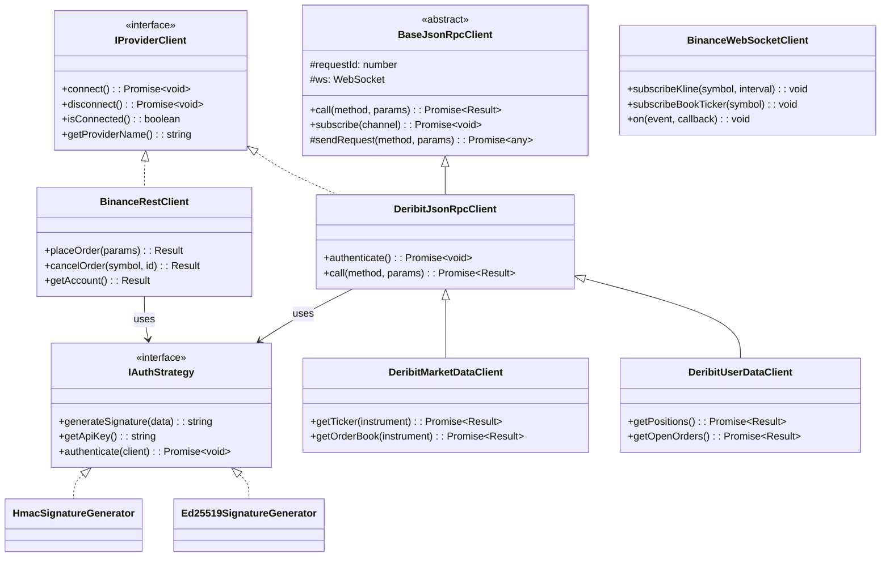
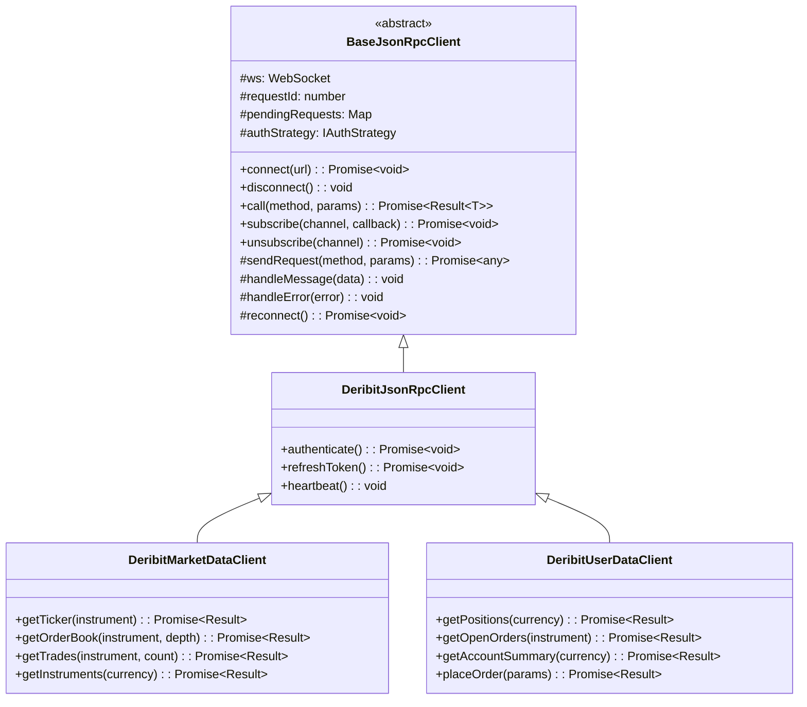
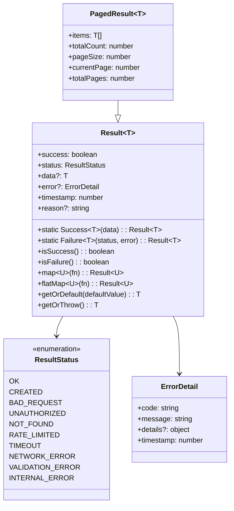
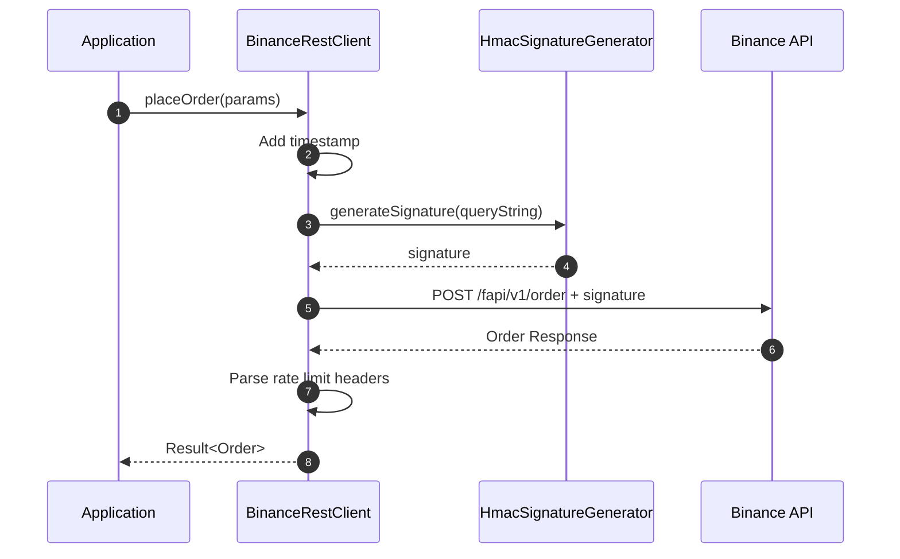
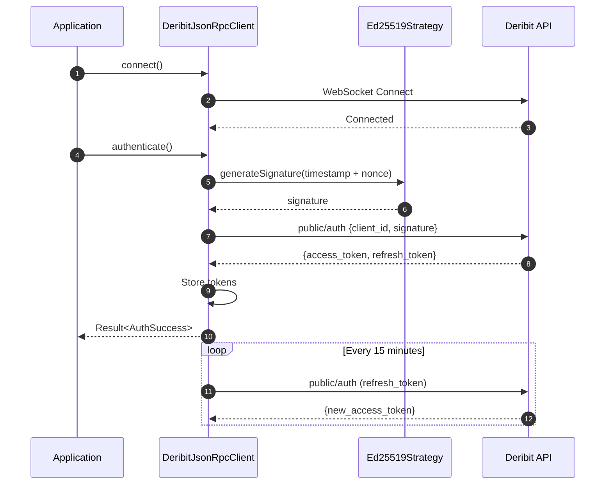
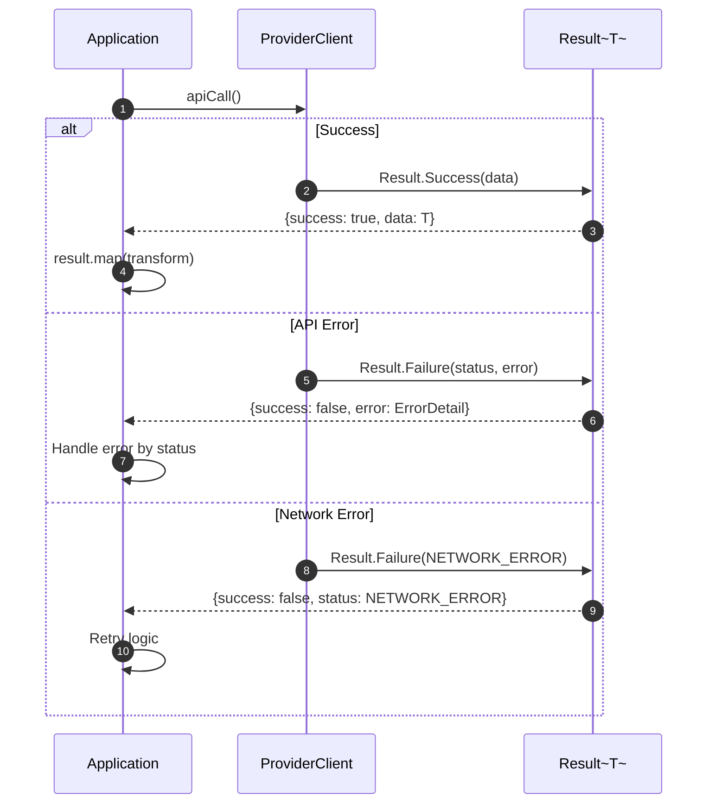

# Ark Alliance Trading Providers Library

[](https://github.com/ArmandRicheletKleinberg/Ark.Alliance.Trading.Bot-React/actions)
[](https://www.npmjs.com/package/ark-alliance-trading-providers-lib)
[](./coverage)
[](./Ark.Alliance.Trading.Providers.Lib.Test)
[](https://www.typescriptlang.org/)
[](./LICENSE)
[](https://nodejs.org/)

---
**Organization**: M2H.Io Ark.Alliance Ecosystem  
**Version**: 1.0.0  
**Last Updated**: 2025-12-29

## What is this Library?

**Ark Alliance Trading Providers Library** is a production-ready, multi-provider TypeScript SDK for building algorithmic trading systems, market data aggregators, and portfolio management applications. It provides a **unified, provider-agnostic API** that abstracts the complexities of connecting to different cryptocurrency exchanges.

### Functional Summary

| Capability | Description |
|:-----------|:------------|
| **Order Management** | Place, modify, cancel, and track orders across exchanges |
| **Position Tracking** | Real-time position monitoring with PnL calculation |
| **Market Data Streaming** | WebSocket-based ticker, order book, and quote subscriptions |
| **Account Operations** | Balance queries, leverage settings, margin type configuration |
| **Event-Driven Architecture** | User data streams for order fills, position updates, account changes |

### Use Cases

| Use Case | How the Library Helps |
|:---------|:----------------------|
| 🤖 **Algorithmic Trading Bots** | Unified order placement API, real-time fills via WebSocket, position management |
| 📊 **Market Data Aggregators** | Subscribe to multiple instruments across providers, normalized quote format |
| 💼 **Portfolio Management** | Cross-exchange position tracking, unified account balance views |
| ⚡ **High-Frequency Trading** | WebSocket-first design, minimal latency REST fallback |
| 🧪 **Trading Strategy Backtesting** | Mock-compatible interfaces, testnet support built-in |
| 🔔 **Event-Based Monitoring** | Account/order/position update streams for alerting systems |

---

## Installation

```bash
npm install ark-alliance-trading-providers-lib
```

### TypeScript Configuration

```json
{
  "compilerOptions": {
    "moduleResolution": "node",
    "esModuleInterop": true
  }
}
```

---

## Table of Contents

1. [What is this Library?](#what-is-this-library)
2. [Installation](#installation)
3. [Module Reference](#module-reference)
4. [Multi-Provider Architecture](#multi-provider-architecture)
5. [Base Class Mechanism](#base-class-mechanism)
6. [Result Pattern](#result-pattern)
7. [Provider: Binance](#provider-binance)
8. [Provider: Deribit](#provider-deribit)
9. [Sequence Diagrams](#sequence-diagrams)
10. [Code Examples](#code-examples)
11. [API Reference](#api-reference)
12. [Testing](#testing)
13. [Dependencies](#dependencies)
14. [Author](#author)


---

## Module Reference

| Module | Path | Documentation |
|:-------|:-----|:--------------|
| **Binance Clients** | `ark-alliance-trading-providers-lib/Binance` | [README](./Src/Binance/clients/README.md) |
| **Binance Services** | - | [README](./Src/Binance/services/README.md) |
| **Binance Mappers** | - | [README](./Src/Binance/mappers/README.md) |
| **Deribit Clients** | `ark-alliance-trading-providers-lib/Deribit` | [README](./Src/Deribit/clients/README.md) |
| **Deribit Services** | - | [README](./Src/Deribit/services/README.md) |
| **Deribit Mappers** | - | [README](./Src/Deribit/mappers/README.md) |
| **Common Services** | `ark-alliance-trading-providers-lib/Common/services` | [README](./Src/Common/services/README.md) |
| **Common Domain** | - | [README](./Src/Common/Domain/README.md) |

---

## Introduction

A comprehensive, multi-provider TypeScript library for interacting with cryptocurrency exchange APIs. Built with a robust architecture featuring:

- 🏗️ **Multi-Provider Design**: Unified interface across exchanges (Binance, Deribit)
- 🔧 **Base Class Mechanism**: Shared functionality through abstract base classes
- ✅ **Result Pattern**: Consistent success/error handling across all operations
- 🔐 **Secure Authentication**: HMAC SHA-256 and Ed25519 signature generation
- ⚡ **Real-time Data**: WebSocket streams for market data and user events
- 📊 **Rate Limiting**: Automatic rate limit tracking and reporting

### Supported Providers

| Provider | Protocol | Status | Features |
|:---------|:---------|:------:|:---------|
| **Binance Futures** | REST + WebSocket | ✅ Complete | Orders, Positions, Market Data, User Streams |
| **Deribit** | JSON-RPC + WebSocket | ✅ Market Data | Market Data complete, Trading in progress |

### Binance API Compliance (December 2025)

> [!IMPORTANT]
> This library is verified against **Binance USDS-M Futures API** as of **December 2025**.

| API Change | Date | Status | Implementation |
|:-----------|:-----|:------:|:---------------|
| `er` (Expiry Reason) field in ORDER_TRADE_UPDATE | Dec 9, 2025 | ✅ | `ExpiryReason` enum, `expiryReason` field in OrderUpdate |
| ALGO_UPDATE `FINISHED` status | Dec 10, 2025 | ✅ | `AlgoOrderStatus.FINISHED` enum value |
| CONDITIONAL_ORDER_TRIGGER_REJECT deprecated | Dec 15, 2025 | ✅ | Deprecation notice added, rejections via ALGO_UPDATE |
| Conditional orders migration to Algo Service | Dec 10, 2025 | ✅ | Full ALGO_UPDATE support with new fields (aid, caid, aq, ap, act) |
| STP Mode mandatory default (EXPIRE_MAKER) | Dec 10, 2025 | ✅ | `selfTradePreventionMode` field supported |
| Price Match mode (`pm` field) | Oct-Dec 2025 | ✅ | `priceMatchMode` field in OrderUpdate |

**Key Files Updated:**
- `Binance/dtos/binance/AlgoOrderUpdate.ts` - Full 2025 API field support
- `Binance/dtos/binance/OrderUpdate.ts` - Expiry reason and STP fields
- `Binance/mappers/OrderMapper.ts` - FINISHED status mapping


## Multi-Provider Architecture



### Directory Structure

```
Src/
├── Binance/                    # Binance Futures Provider
│   ├── clients/               # REST and WebSocket clients
│   ├── dtos/                  # Data Transfer Objects
│   ├── enums/                 # Order types, sides, etc.
│   ├── helpers/               # Signature generation
│   └── index.ts               # Barrel exports
├── Deribit/                    # Deribit Provider
│   ├── clients/               # JSON-RPC clients
│   ├── dtos/                  # Response DTOs
│   ├── enums/                 # Instrument types, etc.
│   └── index.ts               # Barrel exports
├── Common/                     # Shared Components
│   ├── Clients/Base/          # Abstract base clients
│   ├── Domain/                # Domain models
│   ├── helpers/               # Utilities
│   ├── result/                # Result pattern
│   └── services/              # Shared services
└── index.ts                    # Main exports
```

---

## Base Class Mechanism

The library uses abstract base classes to provide shared functionality across providers:

### BaseJsonRpcClient



### IAuthStrategy Interface

Provides pluggable authentication strategies:

```typescript
interface IAuthStrategy {
    generateSignature(data: string): string;
    getApiKey(): string;
    getTimestamp(): number;
    authenticate(client: IProviderClient): Promise<void>;
}
```

**Implementations**:
- `HmacSignatureGenerator` - For Binance (HMAC-SHA256)
- `Ed25519SignatureGenerator` - For Deribit (Ed25519)

---

## Result Pattern

All API operations return a `Result<T>` object providing consistent error handling:



### Result Usage Example

```typescript
import { Result, ResultStatus } from 'ark-alliance-trading-providers-lib';

// Success case
const orderResult = await client.placeOrder(params);

if (orderResult.success) {
    console.log('Order ID:', orderResult.data.orderId);
} else {
    console.error('Error:', orderResult.error?.message);
    console.error('Status:', orderResult.status);
}

// Using functional methods
const orderId = orderResult
    .map(order => order.orderId)
    .getOrDefault('unknown');

// Chaining operations
const position = await client.placeOrder(params)
    .then(result => result.flatMap(order => 
        client.getPosition(order.symbol)
    ));
```

### Safe Execution Utilities

```typescript
import { safeExecuteAsync, tryExecuteAsync } from 'ark-alliance-trading-providers-lib';

// Wrap any async operation in Result
const result = await safeExecuteAsync(async () => {
    // Risky operation
    return await externalApi.call();
});

// With logging
const result = await safeExecuteWithLogAsync(
    async () => api.call(),
    'API Operation',
    logger
);
```

---

## Provider: Binance

### BinanceRestClient

Full REST API client for Binance USDS-M Futures:

```typescript
import { BinanceRestClient } from 'ark-alliance-trading-providers-lib/Binance';

const client = new BinanceRestClient(
    process.env.BINANCE_API_KEY,
    process.env.BINANCE_API_SECRET,
    {
        baseUrl: 'https://fapi.binance.com', // or testnet
        onRateLimitUpdate: (limits) => console.log(limits)
    }
);
```

### BinanceWebSocketClient

Real-time market data and user data streams:

```typescript
import { BinanceWebSocketClient } from 'ark-alliance-trading-providers-lib/Binance';

const ws = new BinanceWebSocketClient({
    baseUrl: 'wss://fstream.binance.com'
});

ws.subscribeKline('BTCUSDT', '1m');
ws.on('kline', (data) => console.log(data));
```

---

## Provider: Deribit

### DeribitJsonRpcClient

Base JSON-RPC 2.0 client for Deribit API:

```typescript
import { DeribitJsonRpcClient } from 'ark-alliance-trading-providers-lib/Deribit';

const client = new DeribitJsonRpcClient({
    clientId: process.env.DERIBIT_CLIENT_ID,
    clientSecret: process.env.DERIBIT_CLIENT_SECRET,
    testnet: true
});

await client.connect();
await client.authenticate();
```

### DeribitMarketDataClient

```typescript
import { DeribitMarketDataClient } from 'ark-alliance-trading-providers-lib/Deribit';

const marketData = new DeribitMarketDataClient(config);
await marketData.connect();

const ticker = await marketData.getTicker('BTC-PERPETUAL');
const orderBook = await marketData.getOrderBook('ETH-PERPETUAL', 10);
```

### DeribitUserDataClient

```typescript
import { DeribitUserDataClient } from 'ark-alliance-trading-providers-lib/Deribit';

const userData = new DeribitUserDataClient(config);
await userData.connect();
await userData.authenticate();

const positions = await userData.getPositions('BTC');
const orders = await userData.getOpenOrders('BTC-PERPETUAL');
```

---

## Sequence Diagrams

### Order Placement Flow (Binance)



### JSON-RPC Authentication Flow (Deribit)



### Result Pattern Flow



---

## Code Examples

### Example 1: Multi-Provider Order

```typescript
import { BinanceRestClient } from 'ark-alliance-trading-providers-lib/Binance';
import { DeribitUserDataClient } from 'ark-alliance-trading-providers-lib/Deribit';

async function placeMultiProviderOrder(symbol: string, side: 'BUY' | 'SELL') {
    // Binance order
    const binance = new BinanceRestClient(apiKey, secret, config);
    const binanceResult = await binance.placeOrder({
        symbol: 'BTCUSDT',
        side,
        type: 'MARKET',
        quantity: 0.002
    });
    
    // Deribit order
    const deribit = new DeribitUserDataClient(deribitConfig);
    await deribit.connect();
    await deribit.authenticate();
    
    const deribitResult = await deribit.placeOrder({
        instrument: 'BTC-PERPETUAL',
        side: side.toLowerCase(),
        type: 'market',
        amount: 0.002
    });
    
    return { binance: binanceResult, deribit: deribitResult };
}
```

### Example 2: Result Pattern Handling

```typescript
import { Result, ResultStatus } from 'ark-alliance-trading-providers-lib';

async function safeOrder(client, params) {
    const result = await client.placeOrder(params);
    
    switch (result.status) {
        case ResultStatus.OK:
        case ResultStatus.CREATED:
            return { success: true, orderId: result.data.orderId };
            
        case ResultStatus.RATE_LIMITED:
            await delay(1000);
            return safeOrder(client, params); // Retry
            
        case ResultStatus.UNAUTHORIZED:
            throw new Error('Invalid API credentials');
            
        case ResultStatus.VALIDATION_ERROR:
            console.error('Invalid params:', result.error?.details);
            return { success: false, error: result.error };
            
        default:
            return { success: false, error: result.error };
    }
}
```

---

## API Reference

### Binance Methods

| Category | Method | Description |
|:---------|:-------|:------------|
| **Orders** | `placeOrder(params)` | Place any order type |
| | `cancelOrder(symbol, id)` | Cancel single order |
| | `cancelAllOpenOrders(symbol)` | Cancel all orders |
| | `getOrder(symbol, id)` | Get order status |
| | `getOpenOrders(symbol?)` | Get open orders |
| **Account** | `getAccountInfo()` | Get account details |
| | `getBalance()` | Get balances |
| | `getPositionRisk(symbol?)` | Get positions |
| | `setLeverage(symbol, leverage)` | Set leverage |
| | `setMarginType(symbol, type)` | Set margin type |
| **Market** | `getPrice(symbol)` | Get current price |
| | `getOrderBook(symbol, limit)` | Get order book |
| | `getKlines(symbol, interval, limit)` | Get candlesticks |
| | `getBookTicker(symbol)` | Get best bid/ask |

---

## Testing

```bash
cd Ark.Alliance.Trading.Providers.Lib.Test
npm run test:execute
```

| Category | Tests | Pass Rate |
|:---------|:-----:|:---------:|
| Account | 8 | 100% |
| Market Data | 8 | 100% |
| Orders | 12 | 100% |
| Positions | 14 | 100% |
| GTX Orders | 13 | 100% |
| Algo Orders | 10 | 100% |
| **Total** | **70+** | **100%** |

---

## Dependencies

| Package | Version | Purpose |
|:--------|:--------|:--------|
| `ws` | ^8.16.0 | WebSocket client |
| `uuid` | ^9.0.1 | Unique ID generation |
| `typescript` | ^5.3.3 | Type support |

---

## Author

**Armand Richelet-Kleinberg**  
IA Solution & Software Architect - Fullstack Devloper  
M2H.Io 
Ark.Alliance Ecosystem

---

*© 2025 M2H.Io Ark.Alliance. All Rights Reserved.*
