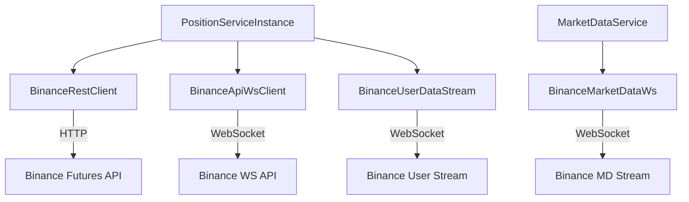

# Clients Module

This module contains all external API clients for interacting with Binance Futures.

## Overview

| Client | Purpose |
|--------|---------|
| `BinanceRestClient` | REST API for account, positions, orders |
| `BinanceApiWsClient` | WebSocket API for real-time order execution |
| `BinanceMarketDataWs` | Market data stream (book tickers, mark price) |
| `BinanceUserDataStream` | User account updates via WebSocket |
| `BinanceSpotClient` | Spot account operations (transfers) |

## Architecture



## Key Features

- **Automatic reconnection** with exponential backoff
- **Request timeout** (30s default)
- **Rate limit tracking** via response headers
- **Environment switching** (TESTNET/MAINNET)

## Usage

```typescript
// Create clients
const restClient = new BinanceRestClient(apiKey, apiSecret, 'MAINNET');
const wsClient = new BinanceApiWsClient(apiKey, apiSecret, 'MAINNET');

// Connect
await wsClient.connect();

// Place order via WebSocket (faster)
const result = await wsClient.placeOrder({
    symbol: 'BTCUSDT',
    side: 'BUY',
    type: 'LIMIT',
    quantity: '0.001',
    price: '50000',
    timeInForce: 'GTC'
});
```

## Files

| File | Description |
|------|-------------|
| `BinanceRestClient.ts` | HTTP client for REST endpoints |
| `BinanceApiWsClient.ts` | WebSocket client for order execution |
| `BinanceMarketDataWs.ts` | Book ticker and mark price streams |
| `BinanceUserDataStream.ts` | Account/order update streams |
| `BinanceSpotClient.ts` | Spot transfers (mainnet only) |
