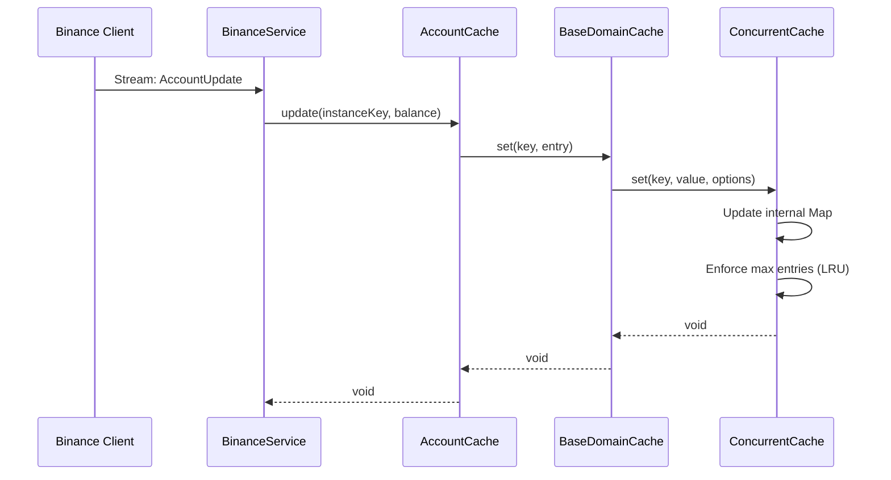
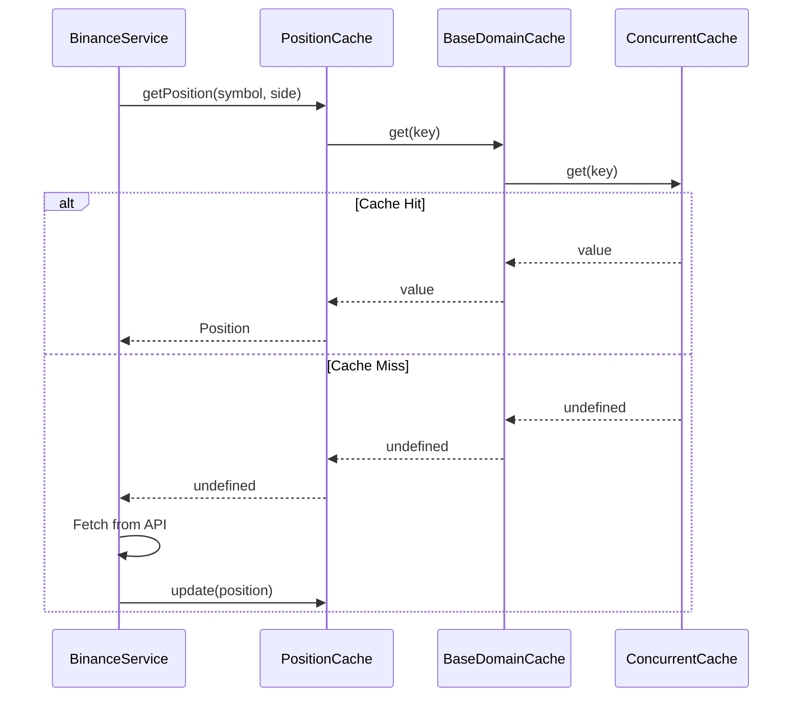
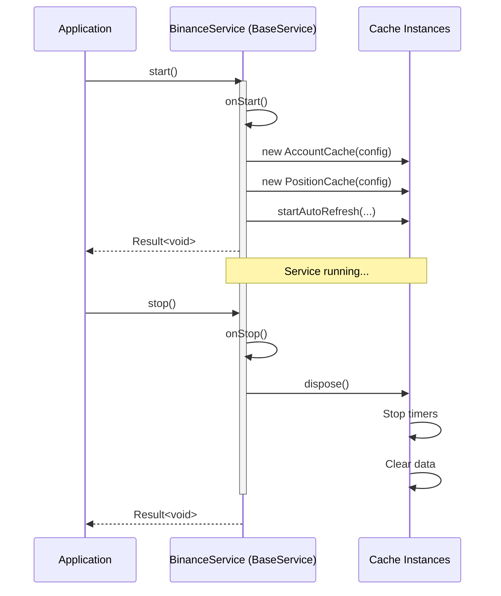

# Domain Cache Layer

**A dependency-injection-ready cache infrastructure built on ConcurrentCache**

---

## Table of Contents

1. [Introduction](#introduction)
2. [Architecture](#architecture)
3. [Cache Classes](#cache-classes)
4. [Usage Examples](#usage-examples)
5. [Sequence Diagrams](#sequence-diagrams)
6. [Integration with BaseService](#integration-with-baseservice)
7. [Dependencies](#dependencies)
8. [Author](#author)

---

## Introduction

The Domain Cache Layer provides specialized caching solutions for Binance trading data, built on top of the generic `ConcurrentCache` infrastructure. All cache classes extend `BaseDomainCache`, which wraps `ConcurrentCache` to provide TTL expiration, LRU eviction, hit/miss statistics, and automatic cleanup.

### Key Features

- ✅ **Dependency Injection Ready** - No singleton pattern, instantiate per service
- ✅ **Lifecycle Management** - Integrates with `BaseService` via `dispose()`
- ✅ **TTL & LRU Eviction** - Automatic cache cleanup
- ✅ **Statistics** - Hit/miss ratios, eviction counts
- ✅ **Zero-Blocking Reads** - Instant memory access

---

## Architecture

```
┌─────────────────────────────────────────────────────────────────┐
│                   BaseService (Service Layer)                    │
│  • Owns cache instances                                          │
│  • Manages lifecycle (start/stop)                                │
│  • Calls cache.dispose() on shutdown                             │
└────────────────┬────────────────────────────────────────────────┘
                 │ composes (1:N)
                 ▼
┌─────────────────────────────────────────────────────────────────┐
│           Domain Cache (e.g., AccountCache)                      │
│  • Extends BaseDomainCache<K, V>                                 │
│  • Adds domain-specific methods                                  │
│  • Example: update(), getBalance(), startAutoRefresh()           │
└────────────────┬────────────────────────────────────────────────┘
                 │ extends
                 ▼
┌─────────────────────────────────────────────────────────────────┐
│                   BaseDomainCache<K, V>                          │
│  • Abstract base class                                           │
│  • Wraps ConcurrentCache<K, V>                                   │
│  • Exposes: get, set, getOrAdd, dispose, getStats                │
└────────────────┬────────────────────────────────────────────────┘
                 │ delegates to
                 ▼
┌─────────────────────────────────────────────────────────────────┐
│                   ConcurrentCache<K, V>                          │
│  • Generic cache with TTL, LRU, statistics                       │
│  • Location: Common/helpers/cache/ConcurrentCache.ts             │
└─────────────────────────────────────────────────────────────────┘
```

---

## Cache Classes

### 📦 BaseDomainCache

**Location:** `Base/BaseDomainCache.ts`

**Purpose:** Abstract base class wrapping `ConcurrentCache` with protected access to core operations.

**Key Methods:**
- `get(key: K): V | undefined`
- `set(key: K, value: V, options?: CacheEntryOptions): void`
- `getOrAdd(key: K, factory: CacheFactory<K, V>): V`
- `dispose(): void`
- `getStats(): CacheStats`

---

### 💰 AccountCache

**Extends:** `BaseDomainCache<string, AccountCacheEntry>`

**Purpose:** Stores account balance with auto-refresh tracking.

**Key Features:**
- Per-instance balance storage
- Auto-refresh with configurable interval
- Staleness tracking

**Example:**
```typescript
const cache = new AccountCache({ defaultTtlMs: 60000 });
cache.update('instance1', accountBalance);
const result = cache.getBalance('instance1');
if (result.success) {
    console.log(`Balance: ${result.data.balance}, Stale: ${result.staleMs}ms`);
}
```

---

### 📊 PositionCache

**Extends:** `BaseDomainCache<string, Position>`

**Purpose:** Tracks open positions with event notifications.

**Key Features:**
- Auto-removal of closed positions (qty = 0)
- Event emission for position changes
- Mark price & leverage updates

**Example:**
```typescript
const cache = new PositionCache();
cache.on('positionClosed', (event) => console.log('Closed:', event));
cache.update(position); // Auto-removes if qty = 0
const active = cache.getActivePositions();
```

---

### 📋 OrderCache

**Extends:** `BaseDomainCache<string, OrderUpdate>`

**Purpose:** Stores order updates with support for both regular and algo orders.

**Key Features:**
- Active order filtering
- Recent order history (configurable retention)
- Symbol and status filtering
- Latency tracking

**Example:**
```typescript
const cache = new OrderCache({ maxOrdersPerInstance: 1000 });
cache.update('instance1', orderUpdate);
const active = cache.getActiveOrders('instance1');
const filled = cache.getOrdersByStatus('instance1', 'FILLED');
```

---

### ⚡ RateLimitCache

**Extends:** `BaseDomainCache<string, RateLimitStatus>`

**Purpose:** Tracks API rate limits per instance and client type.

**Key Features:**
- Per-client tracking (rest/websocket/userdata)
- Auto-calculation of reset times
- Combined limit summaries

**Example:**
```typescript
const cache = new RateLimitCache();
cache.update('instance1', 'rest', rateLimits);
const summary = cache.getSummary('instance1', 'rest');
console.log(`Used: ${summary.limits.requestWeight?.used}/${summary.limits.requestWeight?.limit}`);
```

---

## Usage Examples

### Basic Integration with BaseService

```typescript
import { BaseService } from '../../../Common/services/_BaseService';
import { AccountCache } from './domain/cache/AccountCache';
import { PositionCache } from './domain/cache/PositionCache';
import { OrderCache } from './domain/cache/OrderCache';

class BinanceAccountService extends BaseService {
    private readonly accountCache: AccountCache;
    private readonly positionCache: PositionCache;
    private readonly orderCache: OrderCache;

    constructor(config: ServiceConfig) {
        super(config);
       
        // Instantiate caches with custom config
        this.accountCache = new AccountCache({ 
            defaultTtlMs: 5000,
            refreshIntervalMs: 5000 
        });
        
        this.positionCache = new PositionCache({ 
            defaultTtlMs: 30000 
        });
        
        this.orderCache = new OrderCache({ 
            maxOrdersPerInstance: 1000 
        });
    }

    protected async onStart(): Promise<void> {
        // Start auto-refresh for account data
        this.accountCache.startAutoRefresh(
            this.instanceKey, 
            () => this.fetchAccountBalance()
        );
    }

    protected async onStop(): Promise<void> {
        // Dispose all caches (stops timers, clears data)
        this.accountCache.dispose();
        this.positionCache.dispose();
        this.orderCache.dispose();
    }

    private async fetchAccountBalance(): Promise<void> {
        const balance = await this.binanceClient.getAccountBalance();
        this.accountCache.update(this.instanceKey, balance);
    }
}
```

---

## Sequence Diagrams

### Cache Update Flow



### Cache Read Flow with GetOrAdd



### Service Lifecycle Integration



---

## Integration with BaseService

The refactored cache classes are designed to integrate seamlessly with `BaseService`:

### Before (Singleton Pattern) ❌

```typescript
// OLD - Singleton pattern (tightly coupled)
const accountCache = AccountCache.getInstance();
accountCache.update(instanceKey, balance);
```

### After (Dependency Injection) ✅

```typescript
// NEW - Composition pattern (loosely coupled)
class BinanceService extends BaseService {
    private accountCache = new AccountCache(config);
    
    protected async onStop(): Promise<void> {
        this.accountCache.dispose(); // Lifecycle management
    }
}
```

### Benefits

| Aspect | Singleton | Dependency Injection |
|--------|-----------|---------------------|
| **Testability** | Difficult to mock | Easy to inject mocks |
| **Lifecycle** | Global state, no cleanup | Service owns lifecycle |
| **Configuration** | Global config | Per-instance config |
| **Isolation** | Shared across services | Isolated per service |

---

## Dependencies

### Internal Dependencies

- **`ConcurrentCache`**: `../../../../Common/helpers/cache/ConcurrentCache.ts`
- **`CacheConfig`**: `../../../../Common/helpers/cache/CacheConfig.ts`
- **`CacheEntry`**: `../../../../Common/helpers/cache/CacheEntry.ts`
- **`BaseService`**: `../../../../Common/services/_BaseService.ts`

### External Dependencies

- **Node.js**: `events.EventEmitter` (for PositionCache)
- **TypeScript**: Generics, abstract classes

---

## Author

**Armand Richelet-Kleinberg**  
**M2H.IO** | **Ark.Alliance Ecosystem**

*Institutional-grade trading infrastructure for algorithmic trading systems.*

---

© 2024-2025 Ark.Alliance Ecosystem. All rights reserved.
