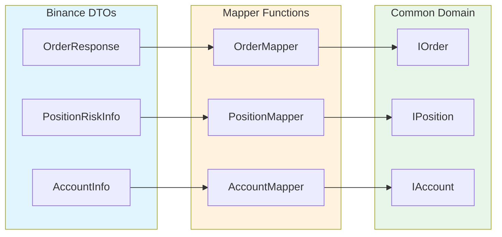

# Binance Mappers

## Overview

Pure functions that transform Binance API responses to common domain models.

---

## Architecture



---

## Files

| File | From | To | Description |
|:-----|:-----|:---|:------------|
| `OrderMapper.ts` | `OrderResponse` | `IOrder` | Maps order fields, status, type |
| `PositionMapper.ts` | `PositionRiskInfo` | `IPosition` | Maps position, PnL, margin |
| `AccountMapper.ts` | `AccountInfo` | `IAccount` | Maps balances, positions |
| `TradeMapper.ts` | `UserTrade` | `ITrade` | Maps fill data |

---

## Usage

```typescript
import { OrderMapper, PositionMapper } from 'ark-alliance-trading-providers-lib/Binance';

// Map single order
const order: IOrder = OrderMapper.toCommon(binanceOrder);

// Map array of positions
const positions: IPosition[] = PositionMapper.toCommonArray(binancePositions);
```

---

## Design Principles

1. **Pure Functions** - No side effects, same input = same output
2. **Null Safety** - Handle missing/undefined fields gracefully
3. **Type Safety** - Full TypeScript type coverage
4. **Testable** - Easy to unit test with mock data
