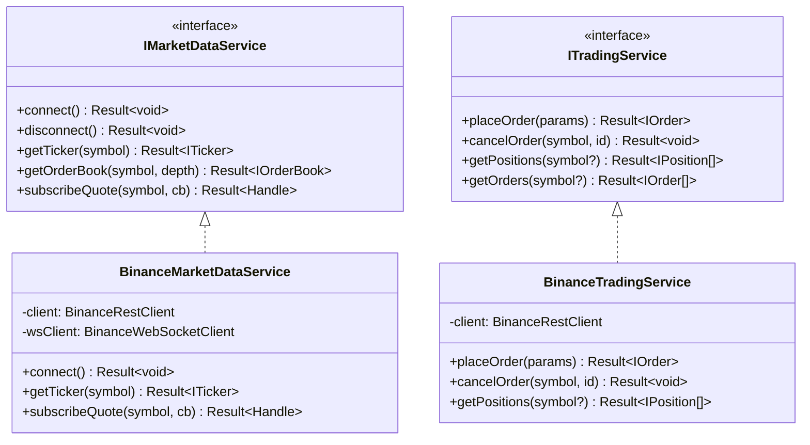
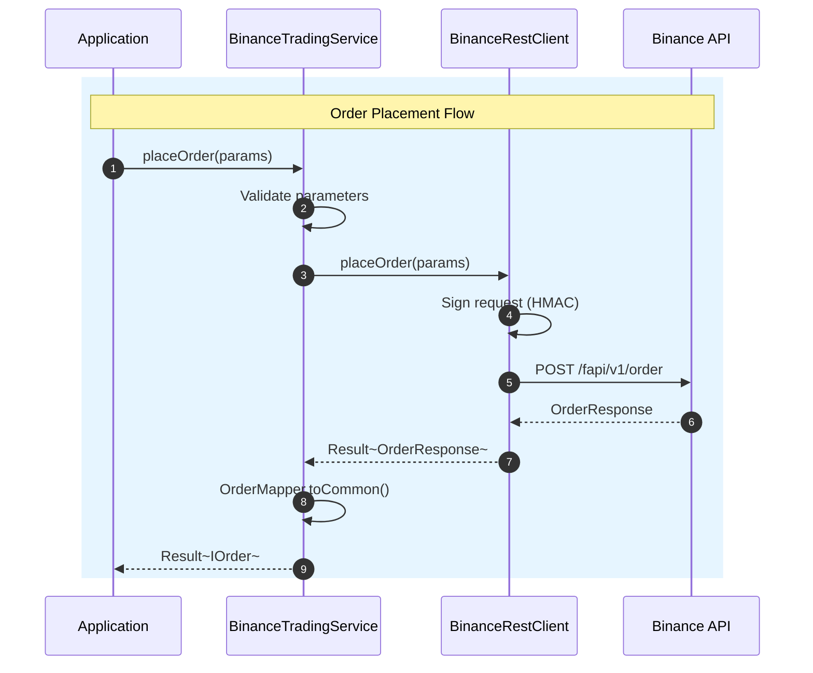

# Binance Services

## Overview

High-level service layer implementing `IMarketDataService` and `ITradingService` interfaces for Binance Futures.

---

## Architecture



---

## Sequence: Order Placement



---

## Files

| File | Interface | Description |
|:-----|:----------|:------------|
| `BinanceMarketDataService.ts` | `IMarketDataService` | Tickers, order books, subscriptions |
| `BinanceTradingService.ts` | `ITradingService` | Orders, positions, account |
| `index.ts` | - | Barrel exports |

---

## Usage

```typescript
import { BinanceTradingService } from 'ark-alliance-trading-providers-lib/Binance';

const tradingService = new BinanceTradingService({
    apiKey: process.env.BINANCE_API_KEY,
    apiSecret: process.env.BINANCE_API_SECRET,
    environment: 'TESTNET'
});

// Place order using common interface
const result = await tradingService.placeOrder({
    symbol: 'BTCUSDT',
    side: 'BUY',
    type: 'MARKET',
    quantity: 0.002
});

if (result.isSuccess) {
    console.log('Order placed:', result.data.orderId);
}
```
