# Common Domain

## Overview

Provider-agnostic domain models and interfaces shared across all exchange implementations.

---

## Architecture

```mermaid
classDiagram
    direction LR
    
    class IOrder {
        <<interface>>
        orderId: string
        symbol: string
        side: OrderSide
        type: OrderType
        status: OrderStatus
        price?: number
        quantity: number
        filledQty: number
    }
    
    class IPosition {
        <<interface>>
        symbol: string
        side: PositionSide
        quantity: number
        entryPrice: number
        markPrice?: number
        unrealizedPnl: number
        leverage: number
    }
    
    class ITicker {
        <<interface>>
        instrument: string
        lastPrice: number
        bidPrice: number
        askPrice: number
        volume24h: number
        timestamp: number
    }
    
    class IOrderBook {
        <<interface>>
        instrument: string
        bids: Level[]
        asks: Level[]
        timestamp: number
    }
    
    class IQuote {
        <<interface>>
        instrument: string
        bidPrice: number
        bidSize: number
        askPrice: number
        askSize: number
    }
    
    class IInstrument {
        <<interface>>
        symbol: string
        baseCurrency: string
        quoteCurrency: string
        tickSize: number
        minQuantity: number
    }
    
    style IOrder fill:#e8f5e9
    style IPosition fill:#e1f5fe
    style ITicker fill:#fff3e0
```



---

## Files

| File | Description |
|:-----|:------------|
| `IOrder.ts` | Order interface with status, type, side |
| `IPosition.ts` | Position with PnL, margin, leverage |
| `ITicker.ts` | Last trade price, 24h stats |
| `IOrderBook.ts` | Bid/ask levels with depth |
| `IQuote.ts` | Best bid/ask snapshot |
| `IInstrument.ts` | Trading pair specifications |
| `ITrade.ts` | Individual trade/fill data |

---

## Usage

```typescript
import { IOrder, IPosition, ITicker } from 'ark-alliance-trading-providers-lib';

// Provider-agnostic order handling
function handleOrder(order: IOrder): void {
    console.log(`${order.symbol}: ${order.side} ${order.quantity} @ ${order.price}`);
}

// Works with any provider
const binanceOrder: IOrder = BinanceOrderMapper.toCommon(binanceResponse);
const deribitOrder: IOrder = DeribitOrderMapper.toCommon(deribitResponse);

handleOrder(binanceOrder);
handleOrder(deribitOrder);
```
