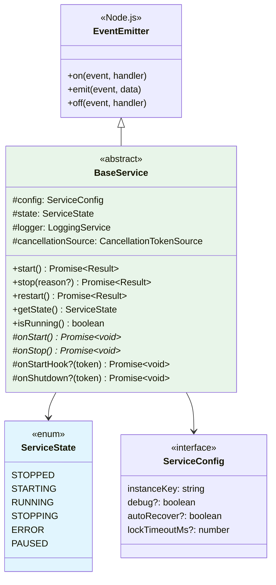
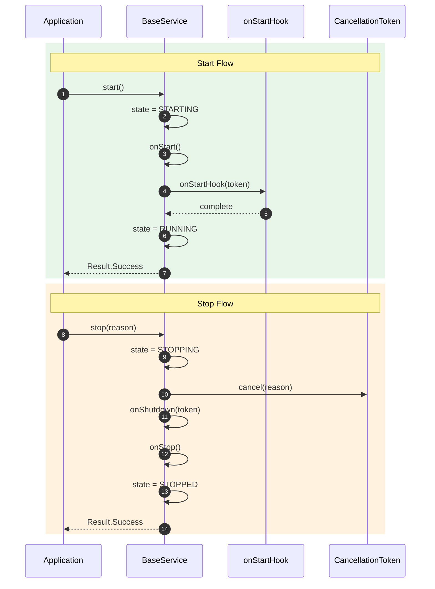

# Common Services

## Overview

Core service infrastructure providing the base class for all provider services with lifecycle management, cancellation support, and streaming capabilities.

---

## Architecture



---

## Sequence: Service Lifecycle



---

## Files

| File | Purpose |
|:-----|:--------|
| `_BaseService.ts` | Abstract base service class |
| `ServiceState.ts` | Lifecycle state enum |
| `ServiceStatus.ts` | Health/operational status |
| `ServiceConfig.ts` | Configuration interface |
| `IStreamingService.ts` | Socket.IO streaming interface |
| `cancellation/` | CancellationToken pattern |
| `events/` | Dynamic event management |

---

## Usage

```typescript
import { BaseService, ServiceConfig, ServiceState } from 'ark-alliance-trading-providers-lib/Common/services';

class MyService extends BaseService {
    constructor(config: ServiceConfig) {
        super(config);
    }
    
    protected async onStart(): Promise<void> {
        // Initialize resources
        this.logger.info('Service starting...');
    }
    
    protected async onStop(): Promise<void> {
        // Cleanup resources
        this.logger.info('Service stopping...');
    }
    
    protected async onStartHook(token: CancellationToken): Promise<void> {
        // Optional: Register event handlers, start background tasks
    }
}

// Usage
const service = new MyService({ instanceKey: 'my-service', debug: true });
await service.start();
console.log(service.isRunning()); // true
await service.stop();
```

---

## Features

| Feature | Description |
|:--------|:------------|
| **Lifecycle Management** | `start()`, `stop()`, `restart()`, `pause()`, `resume()` |
| **Cancellation Support** | `CancellationToken` for graceful shutdown |
| **Auto Recovery** | Configurable retry on error |
| **Async Lock** | `withLock()` for concurrency control |
| **Built-in Cache** | `ConcurrentCache` for multi-instance services |
| **Streaming** | Socket.IO integration for real-time events |
