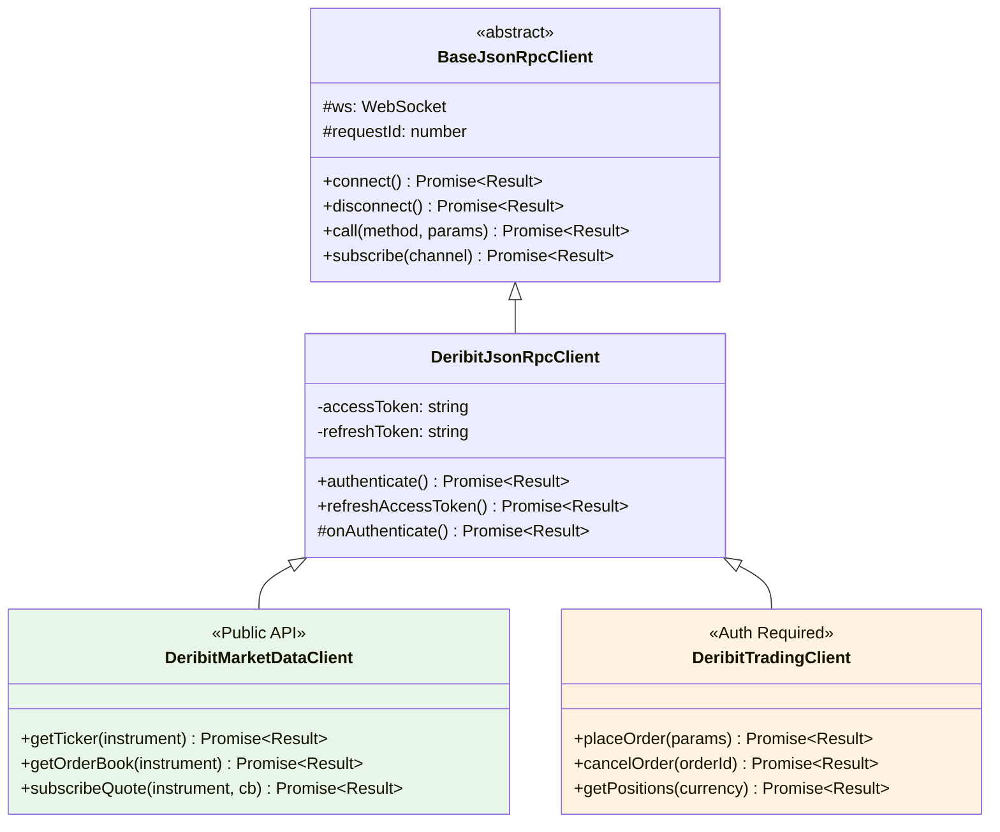
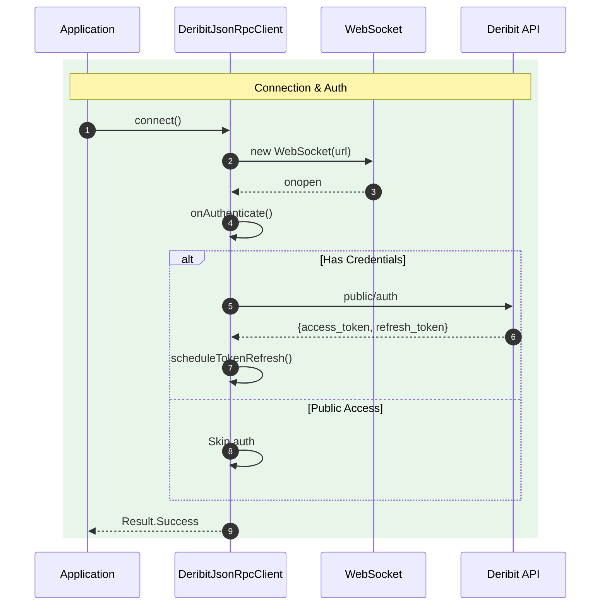

# Deribit Clients

## Overview

JSON-RPC 2.0 clients for Deribit API with OAuth2 authentication and automatic token refresh.

---

## Architecture



---

## Sequence: Authentication Flow



---

## Files

| File | Access Level | Description |
|:-----|:-------------|:------------|
| `DeribitJsonRpcClient.ts` | Base | OAuth2 auth, token management |
| `DeribitMarketDataClient.ts` | Public | Tickers, order books (no auth) |
| `DeribitTradingClient.ts` | Authenticated | Orders, positions |

---

## Usage

```typescript
import { DeribitMarketDataClient, DeribitEnvironment } from 'ark-alliance-trading-providers-lib/Deribit';

// Public market data (no credentials needed)
const client = new DeribitMarketDataClient({
    credentials: { clientId: '', clientSecret: '' },
    environment: DeribitEnvironment.TESTNET
});

await client.connect();
const ticker = await client.getTicker('BTC-PERPETUAL');
```
