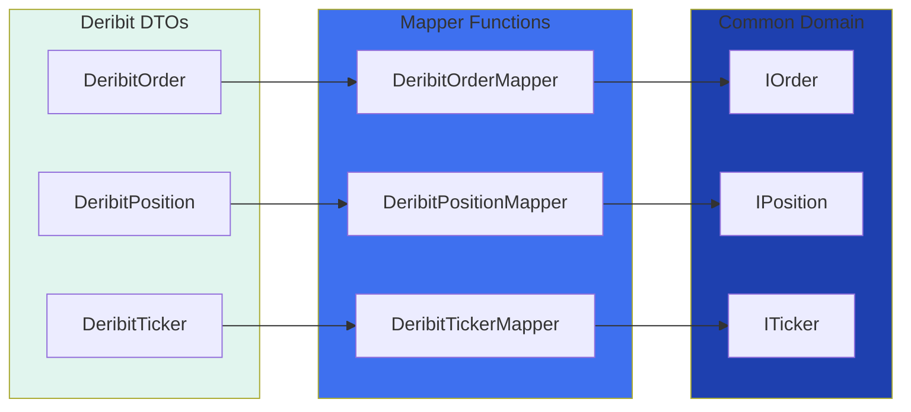

# Deribit Mappers

## Overview

Pure functions transforming Deribit API responses to common domain models.

---

## Architecture



---

## Files

| File | From | To |
|:-----|:-----|:---|
| `DeribitOrderMapper.ts` | `DeribitOrder` | `IOrder` |
| `DeribitPositionMapper.ts` | `DeribitPosition` | `IPosition` |

---

## Enum Mappings

| Deribit | Common |
|:--------|:-------|
| `buy` | `BUY` |
| `sell` | `SELL` |
| `limit` | `LIMIT` |
| `market` | `MARKET` |
| `stop_limit` | `STOP_LIMIT` |
| `stop_market` | `STOP_MARKET` |

---

## Usage

```typescript
import { DeribitOrderMapper, DeribitPositionMapper } from 'ark-alliance-trading-providers-lib/Deribit';

// Map order
const order: IOrder = DeribitOrderMapper.toCommon(deribitOrder);

// Map positions
const positions: IPosition[] = DeribitPositionMapper.toCommonArray(deribitPositions);
```
