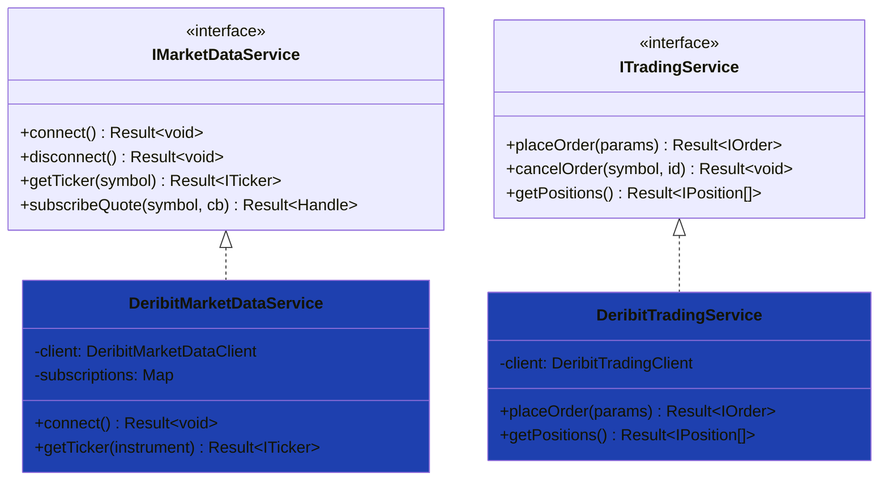

# Deribit Services

## Overview

High-level service implementations for Deribit, wrapping clients with common interfaces.

---

## Architecture



---

## Files

| File | Interface | Status |
|:-----|:----------|:------:|
| `DeribitMarketDataService.ts` | `IMarketDataService` | ✅ Complete |
| `DeribitTradingService.ts` | `ITradingService` | ✅ Complete |

---

## Usage

```typescript
import { DeribitMarketDataService, DeribitEnvironment } from 'ark-alliance-trading-providers-lib/Deribit';

const service = new DeribitMarketDataService({
    environment: DeribitEnvironment.TESTNET,
    defaultCurrency: 'BTC'
});

await service.connect();

// Get ticker
const ticker = await service.getTicker('BTC-PERPETUAL');
if (ticker.isSuccess) {
    console.log('Last:', ticker.data.lastPrice);
}

// Subscribe to quotes
const handle = await service.subscribeQuote('BTC-PERPETUAL', (quote) => {
    console.log('Quote:', quote.bidPrice, quote.askPrice);
});
```
