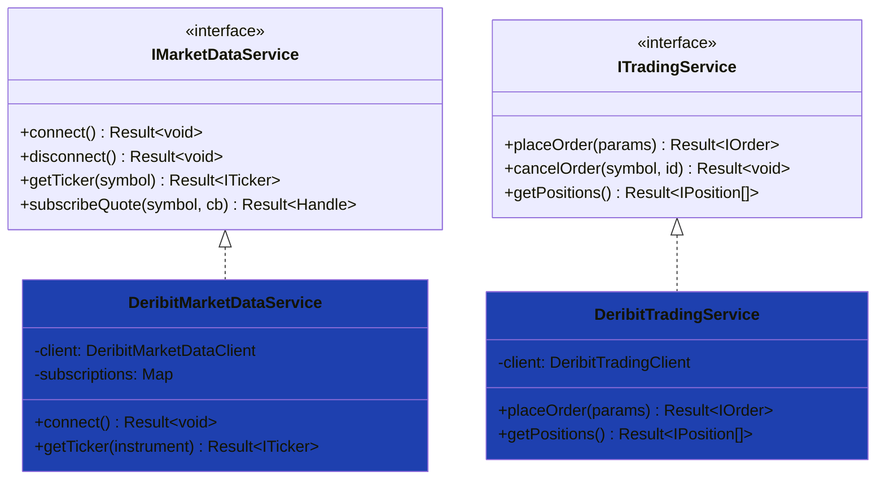

# Deribit Services

## Overview

High-level service implementations for Deribit, wrapping clients with common interfaces.

---

## Architecture



---

## Files

| File | Interface | Status |
|:-----|:----------|:------:|
| `DeribitMarketDataService.ts` | `IMarketDataService` | ✅ Complete |
| `DeribitTradingService.ts` | `ITradingService` | ✅ Complete |

---

## Usage

### Market Data Service (Public)

```typescript
import { DeribitMarketDataService, DeribitEnvironment } from 'ark-alliance-trading-providers-lib/Deribit';

const service = new DeribitMarketDataService({
    environment: DeribitEnvironment.TESTNET,
    defaultCurrency: 'BTC'
});

await service.connect();

// Get ticker - returns common ITicker interface
const ticker = await service.getTicker('BTC-PERPETUAL');
if (ticker.isSuccess) {
    console.log('Last:', ticker.data.lastPrice);
}

// Subscribe to quotes
const handle = await service.subscribeQuote('BTC-PERPETUAL', (quote) => {
    console.log('Quote:', quote.bidPrice, quote.askPrice);
});
```

### Trading Service (Authenticated)

```typescript
import { 
    DeribitTradingService, 
    DeribitEnvironment 
} from 'ark-alliance-trading-providers-lib/Deribit';
import { OrderSide, OrderType } from 'ark-alliance-trading-providers-lib';

const service = new DeribitTradingService({
    apiKey: 'your-client-id',
    apiSecret: 'your-client-secret',
    environment: DeribitEnvironment.TESTNET,
    defaultCurrency: 'BTC'
});

await service.connect();

// Place order - returns common IOrder interface
const order = await service.placeOrder({
    instrument: 'BTC-PERPETUAL',
    side: OrderSide.BUY,
    type: OrderType.LIMIT,
    quantity: '100',
    price: '40000'
});

// Cancel order
await service.cancelOrder({ orderId: order.data.orderId });

// Get positions - returns common IPosition[] interface
const positions = await service.getPositions();

// Close position
await service.closePosition({ instrument: 'BTC-PERPETUAL' });

// Register event callbacks
service.onOrderUpdate((order) => {
    console.log('Order updated:', order.status);
});

service.onPositionUpdate((position) => {
    console.log('Position PnL:', position.unrealizedPnl);
});
```

